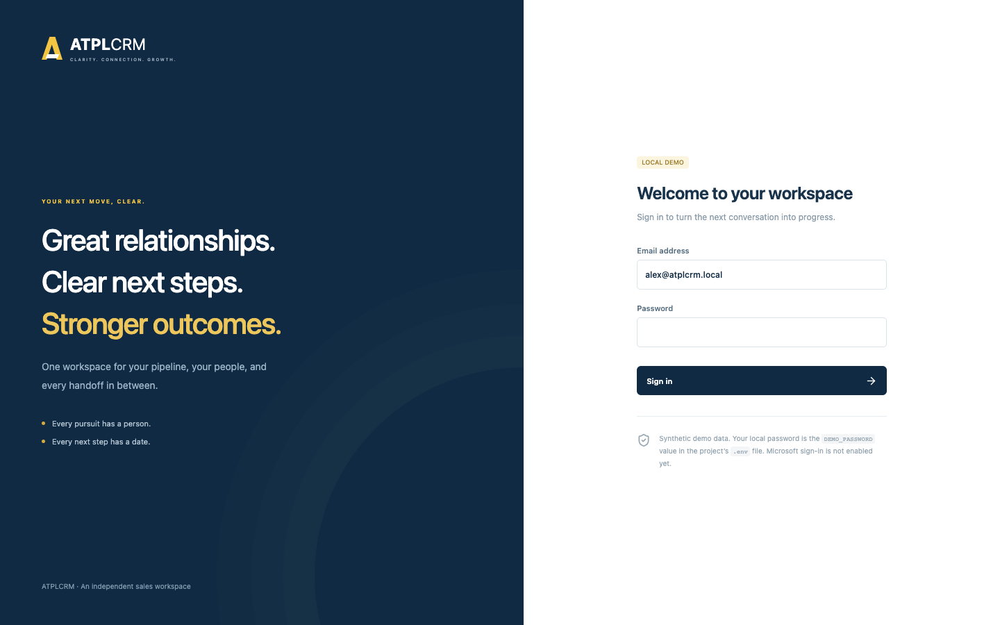
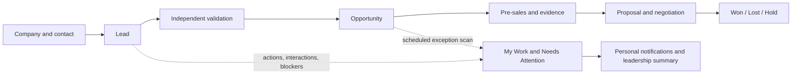
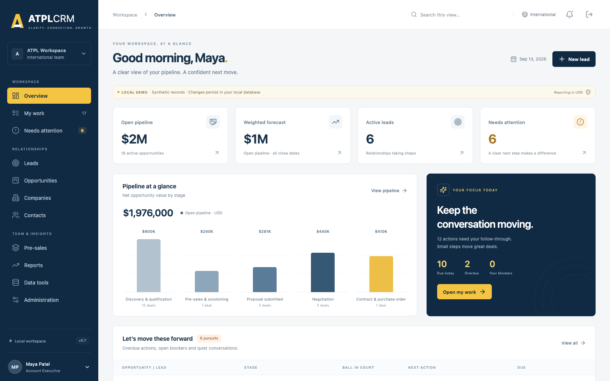
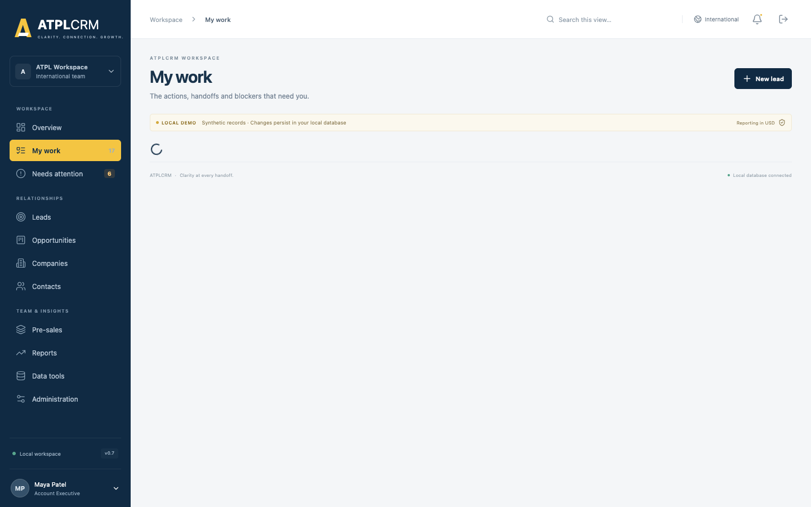
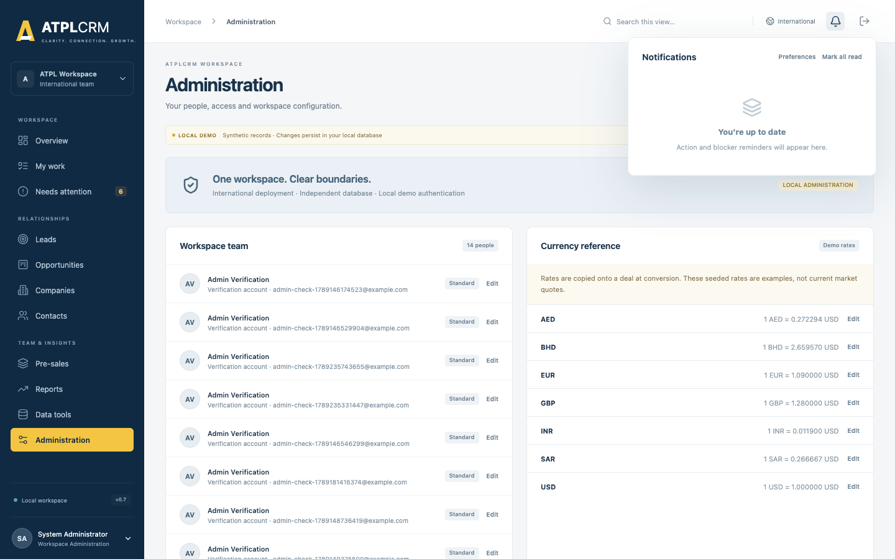
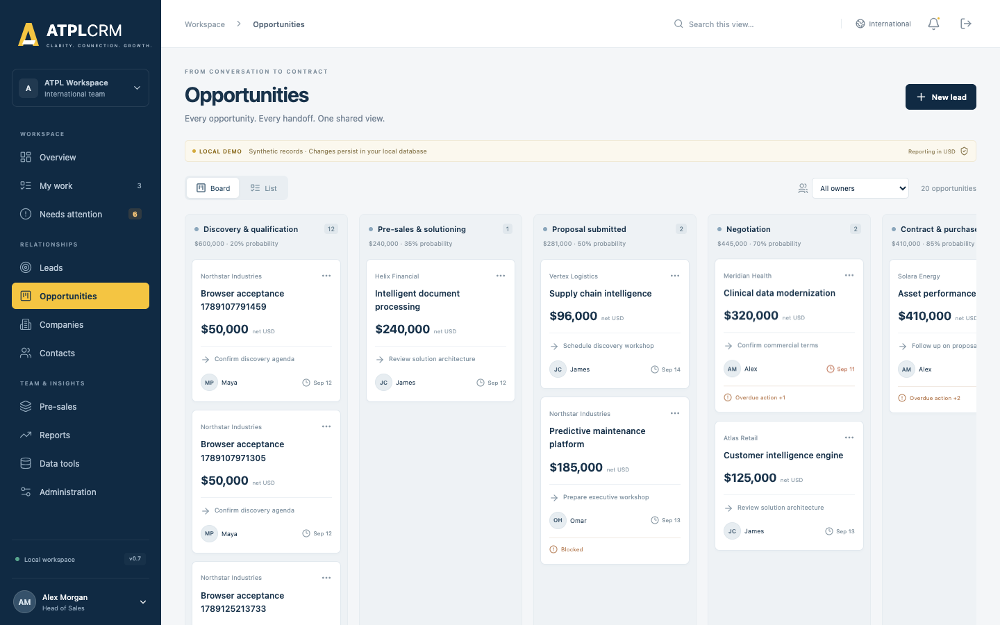
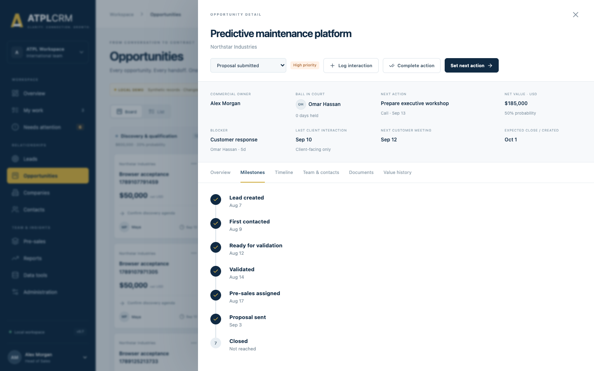
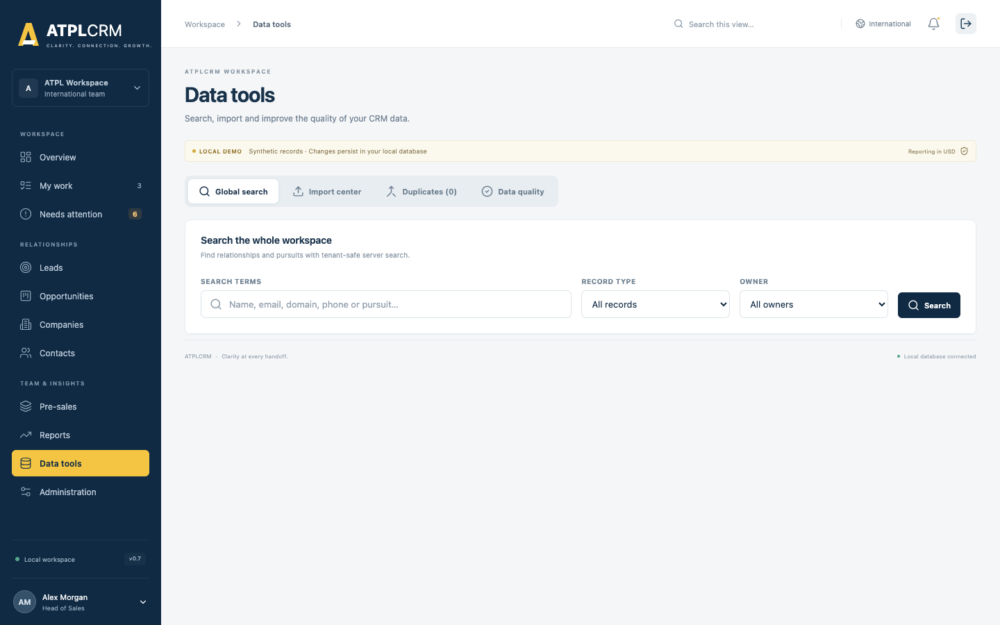
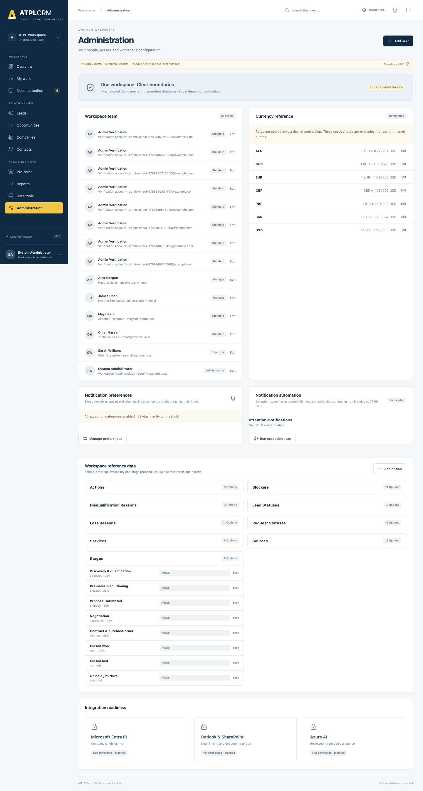

# ATPLCRM v0.14 Manual End-to-End Testing Handbook

**Document purpose:** manually validate every function implemented through ATPLCRM v0.14 before starting another feature.
**Audience:** business testers, administrators, sales users, pre-sales users and release reviewers.
**Execution date:** ____________________  **Tester:** ____________________  **Build/commit:** ____________________
**Environment:** ☐ International  ☐ US  **Result:** ☐ Pass  ☐ Pass with observations  ☐ Fail

> Use synthetic data only. Run this handbook against a disposable local Docker environment because many scenarios create and change records. Record the actual result and evidence for every case; do not mark a case passed only because the control is visible.

## 1. Product and workflow map



ATPLCRM v0.14 is a local CRM workspace built with React, FastAPI, PostgreSQL, Redis/Celery and Docker. The tested business flow is:



Every pursuit has one commercial owner, one Ball in Court holder, one next action and due date, optional blockers, client interactions, team members, stakeholders, documents, a timeline and seven lifecycle milestones. A converted lead remains traceable and its pursuit context continues into the opportunity.

## 2. Scope boundary

This handbook tests what exists in **v0.14**. The following connected services still require Azure tenant configuration and must not be reported as local defects merely because the external service is absent:

| Area | Current v0.14 boundary |
|---|---|
| Identity | Local password sign-in only; Microsoft Entra/OIDC is planned. |
| Authorization | Current owner/team/management rules are testable; a fine-grained policy editor is planned. |
| Imports | CSV and Excel mapped imports up to 20,000 rows, dry runs, errors, fuzzy review and field-by-field merge are included. |
| Documents | All local workflows are included. Azure Blob/SharePoint/Graph adapters and Outlook tenant deployment need Entra/Azure configuration; the in-app selected-email form tests the same registration endpoint locally. |
| Commercial | Partner terms, net values, fixed exchange rates, rate refresh/re-baseline and close/handoff fields are included locally. |
| Pre-sales | Complete assignment, nine-state lifecycle, contributors, review/share evidence, effort, weekly capacity and cost reporting work locally. |
| Reports | Role home dashboards and complete filtered management analytics work locally, with record drill-down and CSV/Excel exports. Connected-scale reconciliation remains pending. |
| AI | No AI provider or simulated AI feature exists in v0.14. |
| Notifications | Durable in-app alerts and scheduled tasks are included; email and mobile delivery are outside v0.14. |

If a current control fails inside these boundaries, record a defect. If Azure tenant connectivity is unavailable, record the connected-only step as **Environment not configured** and still test its local API/UI equivalent.

## 3. Roles and seeded accounts

All seeded accounts use the `DEMO_PASSWORD` value from the selected environment file. Never copy that value into this document or a defect report.

| Account | Access level | Business role | Main acceptance responsibility |
|---|---|---|---|
| `maya@atplcrm.local` | Standard | Account Executive | Company/contact work, leads, owned/team pursuits, actions and interactions |
| `omar@atplcrm.local` | Standard | Technical Lead | Assigned opportunity work and pre-sales deliverables |
| `alex@atplcrm.local` | Manager | Head of Sales | Independent lead validation, pipeline control, bulk assignment, imports and commercial controls |
| `james@atplcrm.local` | Manager | Head of Pre-Sales | Pre-sales assignment, approval and escalations |
| `sarah@atplcrm.local` | Executive | Chief Executive | Management access, reporting, validation and restricted values |
| `admin@atplcrm.local` | Administrator | Workspace Administrator | Users, references, rates and manual notification automation |

### Role rule summary

| Capability | Standard | Manager | Executive | Administrator |
|---|:---:|:---:|:---:|:---:|
| View tenant records and use personal views | ✓ | ✓ | ✓ | ✓ |
| Create company, contact and lead | ✓ | ✓ | ✓ | ✓ |
| Edit a company/contact owned by someone else | — | ✓ | ✓ | ✓ |
| Change an assigned pursuit | Team/owner/holder | ✓ | ✓ | ✓ |
| Independently validate, convert or disqualify a lead | — | ✓ | ✓ | —* |
| Bulk assignment, CSV import and duplicate merge | — | ✓ | ✓ | ✓ |
| Change value visibility or probability | — | ✓ | ✓ | —* |
| Approve pre-sales work to share | — | ✓ | ✓ | ✓ |
| Maintain users, reference data and rates | — | — | — | ✓ |
| Run notification scan manually | — | — | — | ✓ |

`*` Current domain routes for independent validation, value visibility and probability explicitly accept Manager or Executive. Test the Administrator account according to the actual control visibility; do not assume Administrator automatically has every commercial approval permission.

## 4. Test environment preparation

### ENV-01 — Create a disposable International manual-test deployment

**Role:** Local operator
**Precondition:** Docker Desktop is running and port 8084 is free.

1. Open Terminal and run:

   ```sh
   cd /Users/n22/Desktop/ATPLCRM
   cp .env .env.manual
   sed -i '' 's/^COMPOSE_PROJECT_NAME=.*/COMPOSE_PROJECT_NAME=atplcrm-manual/' .env.manual
   sed -i '' 's/^PORT=.*/PORT=8084/' .env.manual
   docker compose --env-file .env.manual up -d --build --wait
   ```

2. Run `docker compose --env-file .env.manual ps`.
3. Open `http://localhost:8084/api/health/`.
4. Open `http://localhost:8084`.

**Expected:** database, Redis, API, worker, scheduler and web are running; the migrate service completed successfully; health returns `status: ok`; the branded login page loads.
**Actual/result:** ______________________________________________________________________

### ENV-02 — Verify schema and application version

1. Run `docker compose --env-file .env.manual exec -T api alembic current`.
2. Run `docker compose --env-file .env.manual exec -T api python -c "from atplcrm.main import app; print(app.version)"`.

**Expected:** migration is `0006_notifications (head)` and application version is `0.7.0`.
**Actual/result:** ______________________________________________________________________

### ENV-03 — Verify persistence across restart

1. Complete a harmless record creation case, such as creating a company.
2. Run `docker compose --env-file .env.manual stop` and then `docker compose --env-file .env.manual start`.
3. Sign in and search for the created record.

**Expected:** the record remains because PostgreSQL uses a named volume.
**Actual/result:** ______________________________________________________________________

### ENV-04 — Verify International and US isolation

1. Create a uniquely named company in the manual International instance.
2. Open the US deployment at `http://localhost:8083` in a private browser and sign in.
3. Search for the unique company.
4. Start a lead conversion in each deployment and inspect currency choices.

**Expected:** the International record is absent from US; sessions do not cross between deployments; International offers configured currencies; US enforces USD and does not show a currency selector.
**Actual/result:** ______________________________________________________________________

### ENV-05 — Record browser evidence

For every failed case, capture the full page, the visible error, role/account, record name, time and case ID. Also save the API response from browser developer tools when the visible message is unclear. Never include passwords or session cookies.

### ENV-06 — Preserve or remove the test environment

- Preserve data for defect investigation: `docker compose --env-file .env.manual down`
- Permanently delete disposable data only after evidence is accepted: `docker compose --env-file .env.manual down -v`

## 5. Authentication, session and navigation

### AUTH-01 — Valid sign-in for every role

For each of the six accounts, enter the email and the password from `.env.manual`, select **Sign in**, and record the displayed name, title and access level.

**Expected:** the Overview page opens; the profile shows the correct identity; no CSRF error appears.
**Actual/result:** ______________________________________________________________________

### AUTH-02 — Invalid credentials

Enter a valid email with an incorrect password, then an unknown email with any password.

**Expected:** access is refused with a generic credential error; no user data or password detail is exposed.
**Actual/result:** ______________________________________________________________________

### AUTH-03 — Sign out and protected navigation

1. Sign in, select the header **Sign out** icon, and use the browser Back button.
2. Directly request `http://localhost:8084/#pipeline`.

**Expected:** the login form is shown and protected workspace data is unavailable.
**Actual/result:** ______________________________________________________________________

### AUTH-04 — Disabled account

1. As admin, create a temporary Standard user and sign in once in a private window.
2. As admin, change the account status to **Inactive**.
3. Retry sign-in and refresh the previously authenticated private window.

**Expected:** active sessions are removed; the inactive account cannot enter the workspace.
**Actual/result:** ______________________________________________________________________

### AUTH-05 — Password reset invalidates sessions

1. Sign in as the temporary user in a private window.
2. As admin, set a new password of at least 12 characters.
3. Refresh the private window, try the old password, then try the new password.

**Expected:** the old session and old password fail; the new password succeeds.
**Actual/result:** ______________________________________________________________________

### AUTH-06 — CSRF recovery across browser tabs

1. Open the login form in Tab A and enter valid credentials without submitting.
2. Open the same login page in Tab B, wait for it to load, then close it.
3. Submit Tab A.

**Expected:** sign-in succeeds after the automatic one-time CSRF refresh; “CSRF validation failed” is not shown. Repeat around one authenticated save if desired.
**Actual/result:** ______________________________________________________________________

### AUTH-07 — Session lifetime

Confirm the configured inactivity timeout is 12 hours. For practical manual acceptance, remove the workspace session cookie in browser developer tools and perform an authenticated action.

**Expected:** the user is returned to sign-in with an authentication/session message. A full 12-hour time-based soak may be recorded separately.
**Actual/result:** ______________________________________________________________________

### NAV-01 — Main navigation and context header

Select every navigation item: Overview, My work, Needs attention, Leads, Opportunities, Companies, Contacts, Documents, Pre-sales, Reports, Data tools and Administration.

**Expected:** the correct title and content load without a full-page error; the header breadcrumb, instance label, profile, notifications and sign-out controls remain available.
**Actual/result:** ______________________________________________________________________

### NAV-02 — Search this view

On Leads and Opportunities, enter part of a record, company, owner or next action in **Search this view**, clear it, and repeat with a non-matching term.

**Expected:** visible board cards update immediately; clearing restores records; no-match state is understandable.
**Actual/result:** ______________________________________________________________________

### NAV-03 — Mobile navigation and layout

At widths 390 × 844 and 768 × 1024, open the navigation drawer, visit Contacts and an opportunity detail, then close the drawer.

**Expected:** no horizontal page overflow, controls remain reachable, tables can scroll inside their containers, and the backdrop/menu controls work by keyboard.
**Actual/result:** ______________________________________________________________________

## 6. Overview, My Work, attention and notifications



### WORK-01 — Overview metrics and drill-through

As Maya, compare active pipeline, weighted forecast, leads and needs-attention counts with their corresponding pages. Select each metric, **View pipeline**, **Open my work**, **View all**, and **View queue**.

**Expected:** totals include only applicable visible records; restricted values do not leak into totals; every control opens the correct page. Recent interactions and pre-sales items show current records.
**Actual/result:** ______________________________________________________________________



### WORK-02 — Personal action queues

As each non-admin role, open **My work** and inspect Overdue actions, Due today and Upcoming actions.

**Expected:** only pursuits where the signed-in user is Ball in Court appear in those three sections, divided by due date; each row opens the correct record.
**Actual/result:** ______________________________________________________________________

### WORK-03 — Owned blockers and assigned deliverables

Assign a blocker to Omar and a pre-sales request to Omar. Sign in as Omar and open My work.

**Expected:** the blocker appears under **Blockers you own** and the open request under **Your deliverables**. Delivered or Cancelled requests do not appear.
**Actual/result:** ______________________________________________________________________

### WORK-04 — Needs Attention exception coverage

Prepare or identify records for each condition and open **Needs attention**:

- overdue next action;
- missing next action/action type;
- Ball in Court held over 14 days;
- blocker unresolved over 10 days;
- no client interaction for 21 days;
- expected close date passed;
- lead awaiting validation over 5 working days;
- overdue pre-sales deliverable.

**Expected:** every condition is a separate issue with severity, explanation and correct drill-through. Correcting the underlying record removes the issue after refresh.
**Actual/result:** ______________________________________________________________________

### WORK-05 — Set the next move

As an assigned user, select **Update** on a pursuit. Change Ball in Court, full next action, action type, future due date, blocker, blocker owner, resolution action, next meeting and reason.

**Expected:** all values persist; a handoff resets days-held; setting a blocker requires owner and resolution; clearing the blocker clears its owner/resolution; changing a next action or holder requires the complete action and a future date.
**Actual/result:** ______________________________________________________________________

### WORK-06 — Complete action and create the next action atomically

Open an assigned pursuit, select **Complete action**, enter outcome, note, new holder, new action/type and a future date.

**Expected:** the current action is stored in Timeline as **Completed action**, the new action becomes current, and both changes appear together. A past/today next date is rejected without partially completing the old action.
**Actual/result:** ______________________________________________________________________

### WORK-07 — Concurrent work update protection

Open the same pursuit in two independent browser sessions. Save a work change in Session A, then submit a different change from Session B without refreshing.

**Expected:** Session B receives a conflict telling the tester to refresh; Session A’s values remain intact.
**Actual/result:** ______________________________________________________________________



### NOTIF-01 — Personal inbox, drill-through and read state

Open the bell panel. Open an unread pursuit notification, mark one item read, then select **Mark all read**.

**Expected:** unread count decreases, read time is retained, the target record opens when present, and state remains after refresh/sign-out/sign-in.
**Actual/result:** ______________________________________________________________________

### NOTIF-02 — Personal preferences

Select **Preferences** from the inbox or **Manage preferences** in Administration. Enable/mute each category and update:

- client inactivity: 7–120 days;
- proposal follow-up: 1–60 days;
- close notice: 1–60 days.

**Expected:** settings persist only for the signed-in user; values outside the ranges are rejected; muted categories stop future deliveries but issues remain visible in My Work/Needs Attention.
**Actual/result:** ______________________________________________________________________

### NOTIF-03 — Administrator manual scan and automation status

As admin, select **Run exception scan**. Refresh Administration.

**Expected:** a success message reports newly created notifications; status shows task name, result, count and completion time. Running again without changed source conditions creates no duplicates. Non-admin roles do not have this control and an unauthorized request is refused.
**Actual/result:** ______________________________________________________________________

### NOTIF-04 — Scheduled task health

Run:

```sh
docker compose --env-file .env.manual logs --tail=100 worker scheduler
```

**Expected:** worker is ready and registers `atplcrm.refresh_notifications` and `atplcrm.weekly_pipeline_summary`; scheduler is running. Exception scans are scheduled every 15 minutes and leadership summaries at 07:00 UTC each Monday.
**Actual/result:** ______________________________________________________________________

### NOTIF-05 — Recipient and escalation rules

Using aged synthetic records, run the scan and verify each rule:

| Trigger | Expected recipient |
|---|---|
| Due today / overdue action | Ball in Court holder |
| Missing next action | Ball in Court holder and commercial owner |
| Ball in Court over 14 days | Holder and relevant function head |
| Blocker over 10 days | Blocker owner and commercial owner |
| Client inactivity threshold | Commercial owner |
| Proposal without follow-up threshold | Commercial owner and Head of Sales |
| Validation over 5 working days | Head of Sales |
| Pre-sales due within 2 days or overdue | Assignee and Head of Pre-Sales |
| Close approaching/passed | Commercial owner |
| Lead nurture/opportunity hold revisit reached | Record owner |
| Automation failure | Administrators who enabled system failures |
| Weekly summary | Manager and Executive users who enabled weekly summary |

**Expected:** delivery follows the table, severity is high for overdue/critical items, and the same source event is deduplicated.
**Actual/result:** ______________________________________________________________________

## 7. Companies, contacts and activities

### REL-01 — Create a company

As Maya, select Companies → **Create company** and enter a unique name, domain, type, industry, country, owner, global account and region.

**Expected:** the company appears in the list and detail; the creator is recorded; a duplicate name is rejected with guidance to use the existing company.
**Actual/result:** ______________________________________________________________________

### REL-02 — Edit company ownership rule

As Maya, edit her company. Create a company owned by Omar and try to edit it as Maya, then as Alex.

**Expected:** owner edits succeed; unrelated Standard user is refused; Manager succeeds. Changes appear in the company detail.
**Actual/result:** ______________________________________________________________________

### REL-03 — Company detail

Open a company and verify its owner, domain, industry, global-account/region data, Contacts, All pursuits and Company interactions. Create more than 20 interactions, use **Load more**, then open a contact and pursuit from the detail.

**Expected:** only records belonging to the company appear; open and closed pursuits are included; the consolidated timeline is newest-first and its shown/total count reaches the complete history through pagination; navigation opens the selected record.
**Actual/result:** ______________________________________________________________________

### REL-04 — Create and edit a contact

Create a contact with company, name, title, seniority, email, phone, mobile, LinkedIn URL, country/city, relationship owner, sourced by, source channel/detail, consent basis, engagement status, relationship notes and outbound-contact choice. Edit every field on the same contact.

**Expected:** values persist, company association is correct, and duplicate email is rejected. Owner/management edit rules match REL-02.
**Actual/result:** ______________________________________________________________________

### REL-05 — Contact detail and engagement counters

Open a contact and compare email, phone/location, owner, source/sourced-by, consent, seniority, first contacted, last touched, outbound touches, notes, associated pursuits and interaction history. Log No response, Responded and Meeting activities and refresh. Add more than 20 entries and use **Load more**.

**Expected:** completed outbound client-facing activity increases touch count and sets first contacted once; last touched follows the newest activity of any type; engagement progresses to Contacted no response, Engaged and Meeting held as applicable; backdated entries do not regress the current status; every linked lead/opportunity and all history pages are accurate.
**Actual/result:** ______________________________________________________________________

### REL-06 — Log client interaction

From a pursuit or contact, select **Log interaction**. Test every configured type, inbound/outbound, each outcome, current time, a backdated completion and optional notes.

**Expected:** entry can be completed quickly; client-facing activity requires a contact; company/contact/pursuit must match; future activity time is rejected; backdated activity sorts by completion time; client-facing activity updates last-client-interaction; Internal note remains visually distinct and does not update pursuit client interaction or contact engagement.
**Actual/result:** ______________________________________________________________________

### REL-07 — Do-not-contact control

Mark a contact **Do not contact**. Try an outbound client interaction without and then with an override reason.

**Expected:** contact status becomes Do not contact and the detail banner explains the control; the first save is blocked; a recorded reason allows the second; the override appears in history; inbound and Internal note behavior remains appropriate.
**Actual/result:** ______________________________________________________________________

### REL-08 — Contact collision notification

As Maya, open the activity form for a contact owned by Omar that already has an outbound touch linked to a pursuit, then log another outbound interaction.

**Expected:** before saving, Maya sees a non-blocking warning naming Omar, the prior outbound date and related pursuit. The save remains available, and Omar receives a durable notification with the same context. Inbound and Internal note entries do not trigger the warning.
**Actual/result:** ______________________________________________________________________

### REL-09 — Company/contact lists

For both lists, test free-text search, owner, country, sort direction, next/previous page and row opening.

**Expected:** results are server-paginated and match every active filter; totals/pages update; controls do not lose state unexpectedly.
**Actual/result:** ______________________________________________________________________

### REL-10 — Personal saved views

Save a filtered Company view and Contact view, apply each, sign out/in, then delete it. Try the same name twice for one entity and use the same name for another entity.

**Expected:** views are private to the current user, persist across sessions, restore filters and can be deleted; duplicate name is rejected only within the same user/entity.
**Actual/result:** ______________________________________________________________________

## 8. Lead lifecycle and independent validation

### LEAD-01 — Create a lead

As Maya, select **New lead** and enter a unique lead name, company, commercial owner, Ball in Court holder, source/detail, area of interest, action/type and future due date.

**Expected:** the lead appears only on the Lead board/list in New status; source, owner, holder and next action match the form; today/past due date is rejected.
**Actual/result:** ______________________________________________________________________

### LEAD-02 — Lead board, list, filters and saved view

Test Board/List, owner, Ball in Court, text, status, priority, country, source, next-action date range, last-client-interaction range, sort/direction, pagination and a saved view containing advanced filters.

**Expected:** every filter combines correctly; saved views restore advanced filters; counts and results agree; opening a result shows the same record; the saved view is personal and persistent.
**Actual/result:** ______________________________________________________________________

### LEAD-03 — Status progression

As an assigned user, move New → Working → Engaged → Ready for validation using the detail status selector.

**Expected:** status persists and each change appears in Timeline; entering Ready records the Ready for validation milestone.
**Actual/result:** ______________________________________________________________________

### LEAD-04 — Nurture

Select **Nurture**, choose a future revisit date, and save.

**Expected:** the lead closes with Nurture outcome and revisit date; the date eventually produces an owner notification when reached; a non-future date is rejected.
**Actual/result:** ______________________________________________________________________

### LEAD-05 — Independent disqualification

Create a lead sourced/owned by Maya and make it Ready. Try disqualification as Maya, as Alex when Alex is made owner, and as an independent Manager/Executive.

**Expected:** the Ready-lead panel names eligible alternate validators; Standard/self-review attempts are refused and identify the alternate route; independent Manager/Executive can choose a configured reason; lead closes as Disqualified and remains traceable.
**Actual/result:** ______________________________________________________________________

### LEAD-06 — Independent validation and conversion

As independent Alex or Sarah, open a Ready lead and provide customer need, scope, primary contact from the same company, initial estimate, currency where applicable, service line and expected signature date.

**Expected:** conversion succeeds once; the original lead closes as Converted; a Discovery opportunity appears; company, source, contacts, team, history and pursuit identity are preserved; initial value history is created using the stored rate.
**Actual/result:** ______________________________________________________________________

### LEAD-07 — Conversion gates and idempotency

Attempt conversion while the lead is not Ready, by a Standard user, by its owner/source Manager, with another company’s contact, invalid currency/service, or missing required data. Submit the same valid conversion twice.

**Expected:** invalid attempts explain the gate and create no opportunity; repeated valid submission returns the same opportunity and never duplicates it.
**Actual/result:** ______________________________________________________________________

### LEAD-08 — Converted lead protection

Open the converted lead and try to change its status.

**Expected:** the UI points work to the linked opportunity and does not reopen/change the converted lead.
**Actual/result:** ______________________________________________________________________

## 9. Opportunity, action and lifecycle testing



### OPP-01 — Board and list

Test Board/List, owner, Ball in Court, text, stage, priority, country, source, service, blocker, partner involvement, next-action and last-interaction ranges, close presets/custom range, USD value range, sort/direction, pagination, saved views and result opening.

**Expected:** advanced filters combine and persist in views; restricted values cannot be inferred through value filters; board columns use configured stage labels/probabilities; hold is excluded; visible net USD totals are correct; list behavior matches the Lead list.
**Actual/result:** ______________________________________________________________________

### OPP-01A — Edit qualified opportunity details

Open an assigned opportunity, select **Edit opportunity**, and change its name, type, need, scope, primary contact, service, engagement type, close date and priority with a reason. Repeat from a stale second session and with a contact from another company through the API.

**Expected:** valid fields update together and Timeline records the reason; a new same-company primary contact is retained as a stakeholder; stale versions conflict and cross-company contacts are refused.
**Actual/result:** ______________________________________________________________________

### OPP-02 — Bulk assignment

In List view, as Alex select one or multiple opportunities/leads, set a commercial owner and/or Ball in Court holder, enter a reason and apply. Repeat as Maya.

**Expected:** Manager succeeds, row versions and audit history update, holder handoff resets held time, and Standard user cannot bulk assign. A stale selected record causes a conflict rather than overwriting.
**Actual/result:** ______________________________________________________________________

### OPP-03 — Drag-and-drop stage movement

As an assigned user, drag an opportunity to another valid stage and enter stage-change evidence.

**Expected:** evidence is required, card moves only after save, configured probability applies, version increments and Timeline records old/new stage and reason. Cancelling leaves the card unchanged.
**Actual/result:** ______________________________________________________________________

### OPP-04 — Accessible stage selector

Open the opportunity and use **Opportunity stage** without drag-and-drop.

**Expected:** it opens the same evidence workflow and produces the same result as OPP-03. Keyboard users can reach and operate the selector.
**Actual/result:** ______________________________________________________________________

### OPP-05 — Team gate for advanced stages

On an opportunity without both roles, attempt Pre-sales, Proposal, Negotiation, Contract and Won. Assign a Pre-sales owner and Tech lead, then retry.

**Expected:** movement is blocked until both roles exist; after assignment it succeeds. Pre-sales assignment records its milestone once.
**Actual/result:** ______________________________________________________________________

### OPP-06 — Hold and revisit

Move an opportunity to Hold without a revisit date, with today’s date, and then with a future date.

**Expected:** missing/non-future dates are rejected; valid hold stores the revisit and excludes the record from active forecast; a reached revisit creates an owner alert.
**Actual/result:** ______________________________________________________________________

### OPP-07 — Close Lost

Move to Lost with and without a configured loss reason; optionally record a competitor.

**Expected:** loss reason is mandatory and must use an active configured value; valid save sets stage probability to 0, records Closed milestone and removes active-work alerts.
**Actual/result:** ______________________________________________________________________

### OPP-08 — Close Won evidence gate

1. Attempt Won with no final Contract, Purchase order or SOW link.
2. Register the evidence link.
3. Retry with contract/PO number, contract date and final value.

**Expected:** first attempt is blocked; missing close fields are rejected; valid attempt sets Won/100%, records final value history and Closed milestone. A user without value access cannot close Won.
**Actual/result:** ______________________________________________________________________

### OPP-09 — Stage concurrency

Open the same opportunity in two independent sessions. Move it in Session A, then submit a different stage from Session B.

**Expected:** Session B gets a refresh conflict and cannot overwrite Session A. No duplicate milestone is created.
**Actual/result:** ______________________________________________________________________

### OPP-10 — Assign pursuit team

As commercial owner/management, assign Pre-sales owner, Tech lead and multiple Supporting contributors. Repeat as an unrelated Standard user.

**Expected:** authorized changes persist and appear under Team & contacts; unique functional roles are replaced rather than duplicated; unrelated Standard user is refused.
**Actual/result:** ______________________________________________________________________

### OPP-11 — Stakeholders

Add a contact from the opportunity company, change its relationship role, and remove it. Try another company’s contact and try to remove the active primary contact.

**Expected:** valid add/edit/remove works and is audited; cross-company contact is unavailable/refused; primary contact cannot be removed.
**Actual/result:** ______________________________________________________________________

### OPP-12 — Record commercial value

As owner or management with value access, record Initial estimate, Proposal value, Revised proposal, Negotiated value and Final contract value with notes.

**Expected:** current value and USD equivalent update; every entry remains in reverse-chronological Value history with original currency/fixed FX rate; invalid type/negative amount is refused.
**Actual/result:** ______________________________________________________________________

### OPP-13 — Probability override

As Manager/Executive, enter 0, 55 and 100 with reasons. Try as Standard.

**Expected:** management values persist with reason; stage remains unchanged; next stage change restores configured stage probability; Standard user is refused.
**Actual/result:** ______________________________________________________________________

### OPP-14 — Restricted commercial values

As Manager/Executive, set restricted visibility with a reason. Inspect the record as management, an assigned team member and an unrelated Standard user.

**Expected:** management/team retain allowed access; unrelated Standard user sees no commercial amount, value history, activity narrative, completed actions or internal evidence. Restricted values do not leak through overview, reports, search or API-driven lists. Restore visibility and verify it returns.
**Actual/result:** ______________________________________________________________________

### OPP-15 — Timeline and immutable action history

Complete actions, log interactions, move stages, assign roles, add stakeholders, record value and add evidence. Inspect Timeline.

**Expected:** entries show author/date/type and correct details in descending order. Completed actions and audit/value history have no UI edit/delete control and remain after later changes.
**Actual/result:** ______________________________________________________________________



### OPP-16 — Seven milestones

Follow one record through lead creation, first outbound contact, Ready, validation, pre-sales assignment, Proposal and Won/Lost.

**Expected:** exactly seven milestones appear in order—Lead created, First contacted, Ready for validation, Validated, Pre-sales assigned, Proposal sent and Closed. Each timestamp is set once and remains after backward stage movement.
**Actual/result:** ______________________________________________________________________

## 10. Pre-sales and evidence

### PRE-01 — Create request

As management or the assigned Pre-sales owner, create a request with opportunity, title, type, needed-by date, meeting date, estimate and notes. Create it as Head of Pre-Sales with a tech lead, and as another authorized requester without assigning. Try assigning as Head of Sales and as Head of Pre-Sales.

**Expected:** authorized creation succeeds; unassigned work stays visible; only Head of Pre-Sales, Executive or Administrator can assign the tech lead; assignment updates the pursuit Tech lead role and the assignee’s My Work; unrelated Standard user is refused.
**Actual/result:** ______________________________________________________________________

### PRE-02 — Request queue

Verify Open requests, Ready for review and Past due metrics; filter by tech lead and every status, search, and open a row. Select several weeks in Weekly team load and change a user’s weekly capacity as Administrator.

**Expected:** status/date metrics and filtered rows agree; title, opportunity, requester, tech lead, contributors, evidence, dates and effort are correct; load shows owned estimates and supporting commitments against configured capacity, including an over-capacity warning.
**Actual/result:** ______________________________________________________________________

### PRE-03 — Status updates and ownership

As the assigned tech lead, exercise each allowed path through Requested, Clarification required, Accepted, In progress, Ready for review, Blocked and Cancelled. Add and remove supporting contributors. Attempt a skipped, backwards-invalid, terminal and stale-version transition.

**Expected:** only allowed adjacent transitions appear; the tech lead owns acceptance/progress and contributors; requester/management controls cancellation and clarification return; Blocked requires a reason; terminal requests cannot change; stale saves conflict; every change is audited.
**Actual/result:** ______________________________________________________________________

### PRE-04 — Approval and delivery gate

As the tech lead, attempt Ready for review without evidence, then link an artifact. Attempt approval as Standard and with an internal-only artifact. As Manager, add review evidence and approve; then let the tech lead deliver with and without actual effort and named client recipients.

**Expected:** review requires linked deliverable evidence; client approval rejects internal-only evidence and requires a Manager plus review note; Delivered is allowed only from Approved to share and requires actual days plus at least one same-company contact; delivery records the exact recipients/share time and removes the work from My Work.
**Actual/result:** ______________________________________________________________________

### PRE-05 — Cost of pre-sales

Deliver several request types across different opportunity service lines, then close some opportunities Won and Lost. As management, open Reports and compare Cost of pre-sales with request records. Repeat as Standard through the API.

**Expected:** delivered-request count and actual days reconcile; groupings by request type, service line and Won/Lost/Open outcome reconcile; undelivered estimates are excluded; Standard report access is refused.
**Actual/result:** ______________________________________________________________________

### DOC-01 — SharePoint/OneDrive link

Open **Documents → Register artifact → M365 link**. Select a pursuit and add title, every artifact type in turn, a valid HTTPS link, visibility and reusable-library choice. Try an invalid URL.

**Expected:** invalid URL is rejected; the valid item appears globally and in the pursuit Documents tab; title, company, pursuit, kind, type and v1 are correct; Open launches the exact URL.
**Actual/result:** ______________________________________________________________________

### DOC-02 — Managed upload and protected download

Upload one allowed document smaller than 10 MB. Try an empty file, a file larger than 10 MB and an executable/script extension. Download the valid file, restart Docker, and download again.

**Expected:** the valid file is private and retrievable only through an authenticated route with the original name; size and checksum metadata exist; invalid/oversized/empty files are rejected without an artifact or orphan; the file persists in the `artifacts` Docker volume.
**Actual/result:** ______________________________________________________________________

### DOC-03 — Visibility and approval

Create one pursuit document and one **Internal team only** artifact. View as an assigned user and unrelated Standard user. Attempt approval as Standard, then as Manager; try approving the internal item.

**Expected:** assigned users see both; unrelated users cannot discover/download the internal item; Standard approval is refused; Manager approval records approver/time; internal artifacts cannot be approved for client sharing.
**Actual/result:** ______________________________________________________________________

### DOC-04 — Named-recipient client sharing

On an approved current artifact choose **Record share**. Try no contacts and a contact from another company through the API, then choose two contacts at the pursuit company and set/omit the date.

**Expected:** invalid recipient sets are rejected atomically; valid sharing records the exact contacts and supplied/current time; the item appears chronologically under **Client-shared** and in its company and opportunity register context.
**Actual/result:** ______________________________________________________________________

### DOC-05 — Version supersession

Create a new version of an uploaded file and an M365 link. Attempt another new version from the now-old row.

**Expected:** the new record is v2 and points to v1; v1 remains visible and marked Superseded; a second branch from v1 conflicts; only the current version can be approved/shared; each version opens its own content/link.
**Actual/result:** ______________________________________________________________________

### DOC-06 — Selected email and automatic attachments

Use **Register artifact → Selected email**. Record subject, Outlook message link/ID, date, direction, participant addresses and each classification. Attach a Proposal-named PDF and Pricing-named spreadsheet. For outbound mail select company contacts; repeat as inbound and internal.

**Expected:** one Linked email artifact is created with readable metadata/classification; supported attachments appear automatically as separate correctly inferred artifacts with no second upload; outbound non-internal mail and attachments share the same date/recipients; inbound/internal records do not enter the client-shared register.
**Actual/result:** ______________________________________________________________________

### DOC-07 — Outlook one-action task pane

After replacing `YOUR-ATPLCRM-HOST` in `apps/web/public/outlook/manifest.xml`, serving ATPLCRM through approved HTTPS and deploying/sideloading the manifest, select an Outlook message and choose **Link to ATPLCRM**. Select pursuit/classification/recipients and submit once.

**Expected:** the task pane reads only the selected message, shows direction/attachment count, creates the same email and attachment records as DOC-06, and states the privacy rule. No mailbox sync, BCC filing or domain matching occurs. If the Azure/Entra host is not configured, mark only this case Environment not configured.
**Actual/result:** ______________________________________________________________________

### DOC-08 — Search and reusable asset library

Search by title, artifact type, original filename and email subject. Add a file/link to the reusable library, open the Library tab, attach it to a different editable pursuit with a new title, then remove the source from the library.

**Expected:** searches return matching tenant-visible rows; superseded items are hidden from current-library results; reuse creates a new pursuit artifact linked to the same controlled content without changing the source; removing the library flag prevents future selection but does not delete existing pursuit records.
**Actual/result:** ______________________________________________________________________

## 11. Search, imports, duplicates and data quality



### DATA-01 — Universal search

Search by company, contact, lead and opportunity text. Filter by record type and owner; test next/previous pages and clear filters.

**Expected:** results are tenant-scoped, filters combine correctly, type/detail/route are accurate and selecting a result opens its destination. Restricted values are not exposed.
**Actual/result:** ______________________________________________________________________

### DATA-02 — Download templates

As Manager/Executive/Administrator, download Company, Contact and Lead templates. Use each template once as CSV and once after saving it as `.xlsx`.

**Expected:** each template contains the documented headers. Both UTF-8 CSV and an unencrypted `.xlsx` workbook are accepted; the first worksheet is used. Standard users cannot perform imports, merges or duplicate dismissals.
**Actual/result:** ______________________________________________________________________

### DATA-03 — Column mapping and dry-run validation

Upload a CSV and an Excel workbook whose headings differ from the template. Map columns and select **Validate file**. Include duplicate headings, duplicate rows and a blank required value.

**Expected:** mapping controls accept the source columns; preview reports total, valid, invalid and possible-duplicate rows without creating records. Duplicate/blank headings and duplicate file rows are rejected clearly.
**Actual/result:** ______________________________________________________________________

### DATA-04 — Company CSV/Excel import

Import valid and invalid company rows including missing name/country, unknown owner and duplicate company.

**Expected:** valid rows import; invalid rows are skipped with row/field errors; no duplicate is silently created; completion totals match.
**Actual/result:** ______________________________________________________________________

### DATA-05 — Complete contact CSV/Excel import

Import rows with valid/unknown company, valid/invalid/duplicate email, owner, sourced-by, title, seniority, phone/mobile, LinkedIn URL, city/country, source/detail, engagement status, do-not-contact, consent and notes.

**Expected:** relationships resolve within the tenant; invalid controlled values and references are reported; exact email duplicates are blocked; valid rows preserve the complete contact field set and synchronize Do not contact status.
**Actual/result:** ______________________________________________________________________

### DATA-06 — Lead CSV import

Import rows with company, owner, Ball in Court holder, sourced-by, source/detail, action values and future/invalid due dates.

**Expected:** valid leads create complete pursuits; invalid references/dates are rejected row by row; successful rows appear in Leads.
**Actual/result:** ______________________________________________________________________

### DATA-07 — Partial import and error report

Use a file containing both valid and invalid rows. Download the validation/error report and import valid rows.

**Expected:** only valid rows are created; error download identifies original rows and reasons; imported/skipped totals are exact.
**Actual/result:** ______________________________________________________________________

### DATA-08 — Import history and limits

Refresh the Import center and inspect filename, file format, entity, status, row counts, errors and warnings. Try an unsupported type, malformed/empty/encrypted workbook, file over 8 MB and file over 20,000 rows.

**Expected:** completed imports remain in history; invalid format/size is rejected clearly; no partial data is created before confirmation.
**Actual/result:** ______________________________________________________________________

### DATA-09 — Exact/fuzzy duplicate review and manual resolution

Create company pairs with exact domains and similar misspelled names, plus contact pairs with matching email/phone or similar names at one company. Open Possible duplicates. Choose either record as the survivor, select the retained value for every field and merge. For another valid pair, enter a reason and select **Not duplicates**.

**Expected:** match reasons and confidence appear; Manager/Executive/Administrator can resolve suggestions; selected values survive; linked contacts, pursuits, activities, primary-contact links, stakeholder links and partner references move safely; the duplicate is archived. Cross-company contacts require company resolution first. A dismissed pair stays hidden with its review reason retained. Same-record, invalid-field, invalid-source and cross-tenant requests are rejected.
**Actual/result:** ______________________________________________________________________

### DATA-10 — Data quality dashboard

Create records missing domain, industry, global-account region, email, phone, source detail or with inconsistent do-not-contact state and overdue/missing action. Open Data quality. Filter by severity/type, page through results, export the displayed set and open an issue.

**Expected:** score counts each affected record once even when it has several issues; record, issue, duplicate and severity totals reconcile; filters/pagination are accurate; exported rows match the displayed filter; each issue shows a recommended correction and opens the exact company, contact or pursuit.
**Actual/result:** ______________________________________________________________________

## 12. Reports and export

Use records with known values, dates, sources, countries, owners, stages, blockers and outcomes. Recalculate a small sample independently before accepting totals.

### RPT-01 — Role-specific home dashboard

Sign in as Executive, Head of Sales, Head of Pre-Sales and Standard user. Select every role-view card, including cards with zero, one and several underlying records.

**Expected:** each role receives four relevant figures; every card is selectable. A single record opens directly and a multi-record figure routes to the appropriate workspace. Values and record identifiers respect the signed-in user's permissions.
**Actual/result:** ______________________________________________________________________

### RPT-02 — Shared report filters

On Reports, exercise 30 days, 90 days, one year, 24 months, all history and a custom range. Combine owner, service, source, country and opportunity type filters. Try an incomplete and reversed custom range.

**Expected:** every visible report recalculates from the same filter set; the selected grouping is retained; invalid custom ranges are rejected clearly; clearing filters restores the unfiltered figures.
**Actual/result:** ______________________________________________________________________

### RPT-03 — Current net pipeline

Compare each stage count and net USD value with the filtered Opportunity records and partner terms. Include Won, Lost, Hold, unresolved partner terms and a restricted opportunity. Use the International local-currency display toggle on the legacy detail view and repeat in US.

**Expected:** open stages, including Hold, appear in current pipeline; Won/Lost are absent; unresolved net values do not inflate totals; authoritative analytics remain net USD; US exposes USD only; restricted values do not leak.
**Actual/result:** ______________________________________________________________________

### RPT-04 — Monthly and quarterly weighted forecast

For several close dates and probabilities, independently calculate `net USD × probability`. Include Hold, Won and Lost opportunities and select month/quarter rows.

**Expected:** monthly and quarter totals reconcile; Hold, Won and Lost are excluded; each row opens the exact contributing records regardless of the historical filter period.
**Actual/result:** ______________________________________________________________________

### RPT-05 — Historical lead funnel

Create or locate Created, Worked, Engaged, Validated, Disqualified and Converted lead cohorts. Compare the lifecycle funnel and breakdowns by source and sourced user, then drill into each figure.

**Expected:** stages are cumulative lifecycle achievements within the selected created-date cohort; source/user totals reconcile with their records; converted leads retain their original lead history; drill-down opens the exact pursuit.
**Actual/result:** ______________________________________________________________________

### RPT-06 — Seven-transition bottlenecks

Check all seven transitions from Lead created through Closed using pursuits with known milestone dates. Change the working week/holiday calendar as Administrator and rerun.

**Expected:** exactly seven rows appear; unconverted leads are included in early milestones; median elapsed working days exclude configured non-workdays and holidays; every count drills into its completed records.
**Actual/result:** ______________________________________________________________________

### RPT-07 — Blocker age and ownership

Add blockers to both leads and opportunities with different types, owners and start dates. Compare the type and owner views.

**Expected:** only open pursuits are counted; count, median days and oldest days reconcile; both lead and opportunity blockers appear; each row drills into the matching records.
**Actual/result:** ______________________________________________________________________

### RPT-08 — Outcomes and loss distribution

Group a known Won/Lost sample by service, source, country, opportunity type and owner. Check win rate, average net won deal size, median working-day cycle and every loss reason.

**Expected:** only records closed in the selected date range contribute; all five groupings reconcile; loss reasons total to Lost records; zero-win groups show no misleading average; drill-down matches each aggregate.
**Actual/result:** ______________________________________________________________________

### RPT-09 — Value erosion

For Won opportunities, record an Initial estimate and Final contract value. Test increases, decreases, multiple currencies and missing initial/final values; group by service and owner.

**Expected:** server-side stored FX produces reproducible initial/final USD, erosion amount and percentage; only complete pairs contribute; grouped deal counts and drill-down records reconcile.
**Actual/result:** ______________________________________________________________________

### RPT-10 — Movement

Within a known date window, validate opportunities, advance one, regress one, close one and move one expected close date later. Select Entered, Advanced, Regressed, Closed and Slipped.

**Expected:** each pursuit is counted once per movement category for the selected dates; stage audit events and close-date before/after values support the classification; drill-down does not expose inaccessible records.
**Actual/result:** ______________________________________________________________________

### RPT-11 — Individual performance

As management, compare every user across Leads generated, Opportunities owned, Pre-sales delivered, current Ball in Court and Blockers owned. Sign in as a Standard user and repeat.

**Expected:** management sees the team; every number is selectable and reconciles with its records; Standard sees only their own row; active lead and opportunity handoffs/blockers both contribute where applicable.
**Actual/result:** ______________________________________________________________________

### RPT-12 — CSV, Excel and permission-safe drill-down

From every report tab, export CSV and Excel after applying filters. Open both formats, compare headers/rows/totals and inspect a value beginning with `=`, `+`, `-` or `@`. Repeat around a restricted opportunity as assigned management/team and as an unrelated Standard user.

**Expected:** the selected report dataset and filters are preserved; CSV opens as UTF-8 and dangerous spreadsheet prefixes are escaped; `.xlsx` opens as a valid workbook; hidden values and records are absent from figures, drill-downs and both exports.
**Actual/result:** ______________________________________________________________________

## 13. Administrator testing



### ADMIN-01 — Administration visibility

Open Administration as admin and each non-admin role.

**Expected:** all users see their own profile, currency reference, notification preferences and integration-readiness information; only admin sees editable Workspace team, rates/reference controls and manual automation controls. Server authorization rejects direct non-admin admin requests.
**Actual/result:** ______________________________________________________________________

### ADMIN-02 — Create user

Create Standard, Manager, Executive and Administrator test users using unique emails and passwords of at least 12 characters.

**Expected:** each active user appears with correct identity/title/level and can sign in. Duplicate email, invalid email and short password are rejected.
**Actual/result:** ______________________________________________________________________

### ADMIN-03 — Edit user and access level

Change name, email, title and access level, then sign in as that user.

**Expected:** profile and permissions reflect the change. Email stays unique and normalized.
**Actual/result:** ______________________________________________________________________

### ADMIN-04 — Account activation and password

Repeat AUTH-04 and AUTH-05; reactivate the account and confirm only the current password works.

**Expected:** activation and session invalidation are immediate and tenant-scoped.
**Actual/result:** ______________________________________________________________________

### ADMIN-05 — Protect current administrator

As admin, try to deactivate the signed-in account or remove its Administrator access.

**Expected:** both changes are refused so the current administrator cannot lock itself out.
**Actual/result:** ______________________________________________________________________

### ADMIN-06 — Add reference option

Add options to Sources, Service lines, Action types, Blocker types, Loss reasons and Disqualification reasons. Try adding a duplicate code and a new workflow stage/status code.

**Expected:** supported additions appear in corresponding forms after refresh; duplicate code is rejected; stage, lead-status and request-status codes cannot be added because their stable workflow codes are locked.
**Actual/result:** ______________________________________________________________________

### ADMIN-07 — Edit reference option

Edit label, sort order and availability; edit a stage probability. Deactivate an option and inspect new forms while opening old records that already use it.

**Expected:** labels/order/probabilities update; inactive options cannot be selected for new changes while historical records remain understandable; stable code does not change. The default `None` blocker cannot be disabled and stage probability cannot be blank.
**Actual/result:** ______________________________________________________________________

### ADMIN-08 — Exchange rates

Update a non-USD rate and source, convert a new lead in that currency, then change the rate again.

**Expected:** future conversion uses the latest rate; the existing opportunity/value history retains its original fixed rate. USD remains exactly 1 and cannot be changed. US deployment exposes USD only.
**Actual/result:** ______________________________________________________________________

### ADMIN-08A — Working calendar

Configure Monday–Friday, then Sunday–Thursday, and add a known holiday. Recheck lifecycle and movement reports. Try the same API request as a non-admin.

**Expected:** selected workdays and holidays persist, report durations exclude non-working dates, alerts use the same calendar, and non-admin updates are refused.
**Actual/result:** ______________________________________________________________________

### ADMIN-09 — Integration readiness

Inspect Microsoft identity, email/document integration and other readiness cards.

**Expected:** planned integrations are described honestly and no unavailable integration can be enabled or mistaken for connected functionality.
**Actual/result:** ______________________________________________________________________

## 14. Cross-role authorization and audit acceptance

### SEC-01 — Assigned-team authorization

Use one opportunity with Maya as owner, Alex as holder, James as Pre-sales owner and Omar as Tech lead. Try work updates as each and as an unrelated Standard user.

**Expected:** owner, source, holder, explicit team and management can work according to current rules; unrelated Standard user can view tenant data but cannot change that pursuit.
**Actual/result:** ______________________________________________________________________

### SEC-02 — Management-only operations

As Standard, attempt independent conversion/disqualification, bulk assignment, import, merge, restricted-value change, probability override and pre-sales approval. Repeat with the appropriate Manager/Executive.

**Expected:** Standard is refused and no data changes; the eligible management role succeeds when business gates are met.
**Actual/result:** ______________________________________________________________________

### SEC-03 — Administrator-only operations

As a non-admin, attempt user/reference/rate maintenance and manual notification scan, including a direct API call captured from developer tools.

**Expected:** UI control is absent and server returns forbidden; no data changes.
**Actual/result:** ______________________________________________________________________

### SEC-04 — Tenant isolation

Copy a record identifier from International and request it while authenticated to US, then reverse the test.

**Expected:** record is not found/available; no name, value, contact, timeline, notification or import information crosses tenant boundaries.
**Actual/result:** ______________________________________________________________________

### SEC-05 — Audit timeline completeness

For a single pursuit, complete at least one change from every implemented workflow and inspect Timeline after each save.

**Expected:** user, time, action and useful detail are present for status, work/handoff, stage, value, restriction, probability, team, stakeholder, activity, request, document and completed-action changes.
**Actual/result:** ______________________________________________________________________

### SEC-06 — Database immutability guards

On the disposable database only, identify one row in `crm_auditevent`, `crm_valuehistory` and `crm_pursuitaction`, then attempt an ordinary `UPDATE` and `DELETE` inside a transaction using the application database role.

**Expected:** PostgreSQL rejects mutation of protected historical rows. Roll back the transaction and retain the error as evidence. Do not perform this case on a shared or production database.
**Actual/result:** ______________________________________________________________________

### SEC-07 — Error quality and atomicity

For key forms, deliberately omit mandatory fields, use invalid dates/URLs/numbers and violate a permission or workflow gate.

**Expected:** a specific message identifies the correction; modal data is not silently lost; no partial company/contact/lead conversion/action completion/stage close/request delivery is committed.
**Actual/result:** ______________________________________________________________________

### SEC-08 — Keyboard and basic accessibility

Use Tab/Shift+Tab, Enter, Space and Escape through login, navigation, board/list switch, forms, detail tabs, notifications and dialogs. Check visible focus and labels using browser accessibility inspection.

**Expected:** focus is visible and logical, controls have names, dialogs can be completed/closed, stage selection works without drag, and color is not the sole meaning. Record any screen-reader or contrast issue as an accessibility defect; a full formal audit remains pending.
**Actual/result:** ______________________________________________________________________

## 15. Final regression route

Execute this sequence on one named synthetic pursuit to prove the full handoff:

1. Admin creates/reactivates all required test users and validates reference options/rates.
2. Maya creates a company and contact, sets consent and logs the first interaction.
3. Maya creates a lead, changes status through Ready and assigns a future action.
4. Independent Alex validates and converts it; confirm preserved source/contact/history and initial value.
5. Alex assigns James as Pre-sales owner and Omar as Tech lead; adds/edits stakeholders.
6. The holder completes an action and hands off a new future action; add and resolve a blocker.
7. James creates a pre-sales deliverable; Omar progresses it; James/Alex approves; Omar delivers with actual effort.
8. Add Proposal evidence, move through Pre-sales and Proposal, log client follow-up, revise value and inspect fixed FX history.
9. Test Hold/revisit, return to active stage, then add Contract/PO/SOW evidence and close Won; separately close another record Lost.
10. Verify all seven milestones, Timeline, Documents, Value history, My Work, Needs Attention, notifications and reports.
11. Save views, perform a controlled bulk assignment, search the records globally and export forecast CSV.
12. Run the admin notification scan twice; verify correct routing, read state, deduplication and automation status.
13. Sign in as unrelated Standard, assigned Standard, Manager, Executive and Administrator to validate visibility and prohibited actions.
14. Restart Docker and confirm data, preferences, read state, saved views, imports and histories persist.

**Overall regression result:** ☐ Pass  ☐ Fail
**Evidence location:** __________________________________________________________________

## 16. Coverage checklist

Use this as the final completeness gate.

| Capability | Cases | Result |
|---|---|---|
| Docker, migration, health, persistence and instance isolation | ENV-01–04 | ☐ |
| Login, logout, inactive users, reset, session and CSRF recovery | AUTH-01–07 | ☐ |
| Navigation, local search and responsive shell | NAV-01–03 | ☐ |
| Overview, My Work, Needs Attention, next move, action history and concurrency | WORK-01–07 | ☐ |
| Preferences, inbox/read history, scan, scheduler and all recipient rules | NOTIF-01–05 | ☐ |
| Company/contact CRUD, ownership, engagement, DNC and collision | REL-01–10 | ☐ |
| Lead create/status/nurture/disqualify/convert and preservation | LEAD-01–08 | ☐ |
| Pipeline board/list, stages, gates, roles, stakeholders, values and milestones | OPP-01–16 | ☐ |
| Pre-sales request/status/approval/effort and evidence links | PRE-01–05 | ☐ |
| Upload/link/email artifacts, sharing register, versions and reusable library | DOC-01–08 | ☐ |
| Global search, CSV templates/imports/errors/history, duplicates and quality | DATA-01–10 | ☐ |
| Role dashboards, analytics, drill-down and CSV/Excel exports | RPT-01–12 | ☐ |
| Users, access levels, reference data, probabilities and rates | ADMIN-01–09 | ☐ |
| Cross-role/tenant authorization, audit, immutability, errors and accessibility | SEC-01–08 | ☐ |

## 17. Defect record template

| Field | Entry |
|---|---|
| Defect ID / test case | |
| Summary | |
| Environment / URL / commit | |
| Signed-in account and access level | |
| Record name/ID | |
| Preconditions | |
| Exact steps | |
| Expected result | |
| Actual result | |
| Screenshot/video/API response | |
| Severity: Blocker / High / Medium / Low | |
| Reproducibility | |
| Retest result and commit | |

### Release decision

- **Pass:** every applicable case passes and no open Blocker/High defect remains.
- **Pass with observations:** core business flow passes; accepted Medium/Low observations have owners and target releases.
- **Fail:** a critical role, data boundary, stage/action transaction, financial visibility, audit history or persistence case fails.

**Decision:** ____________________  **Approved by:** ____________________  **Date:** ____________________
