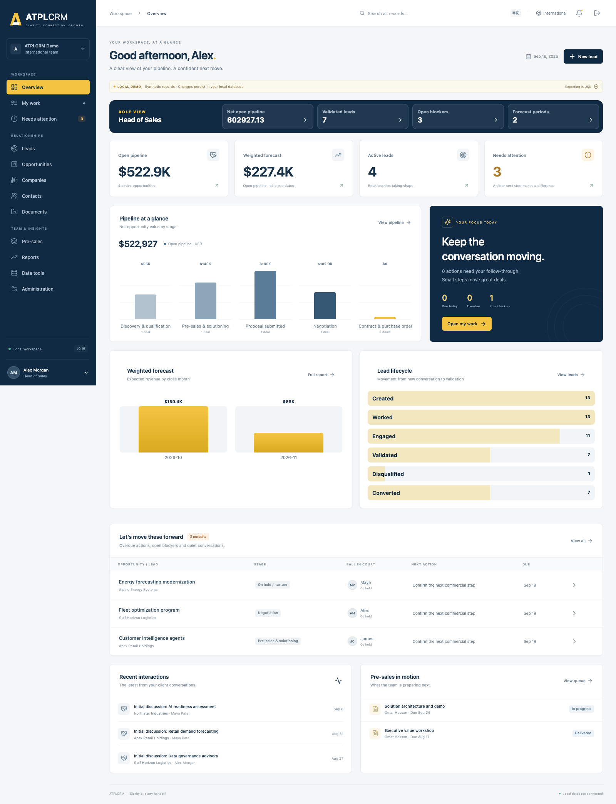
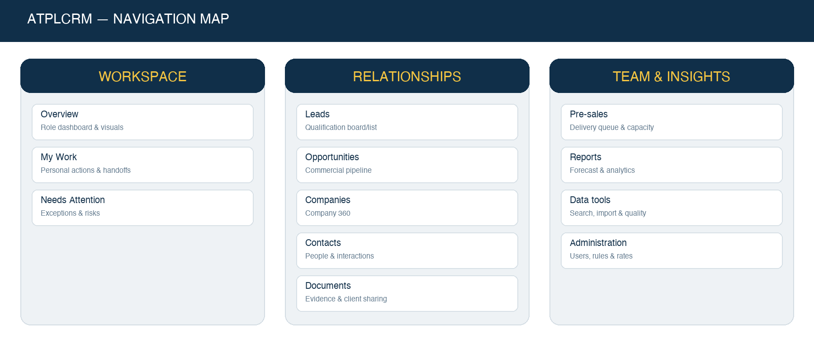
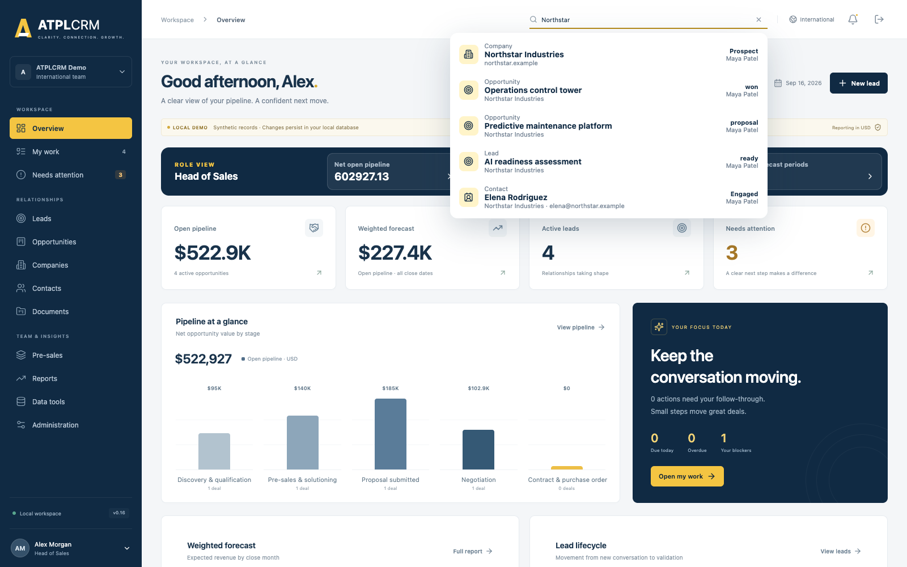
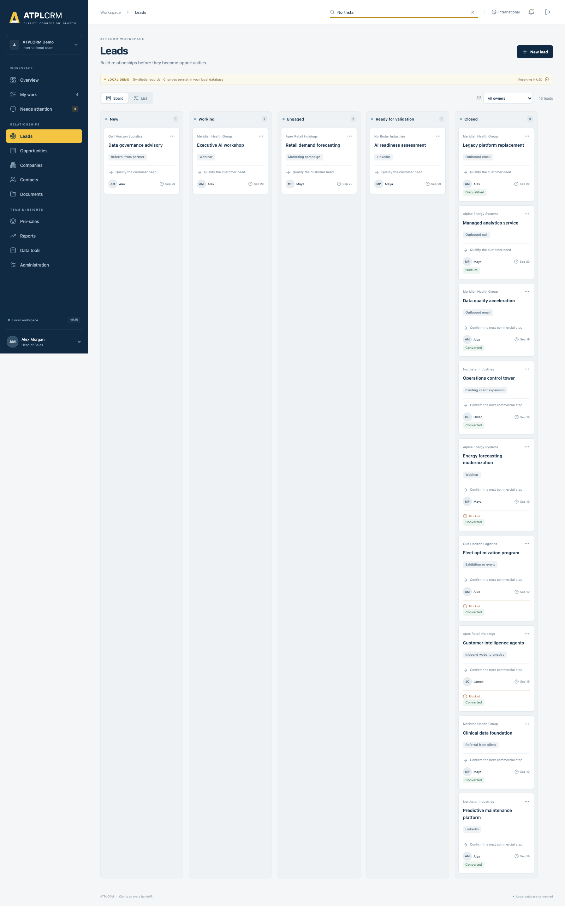
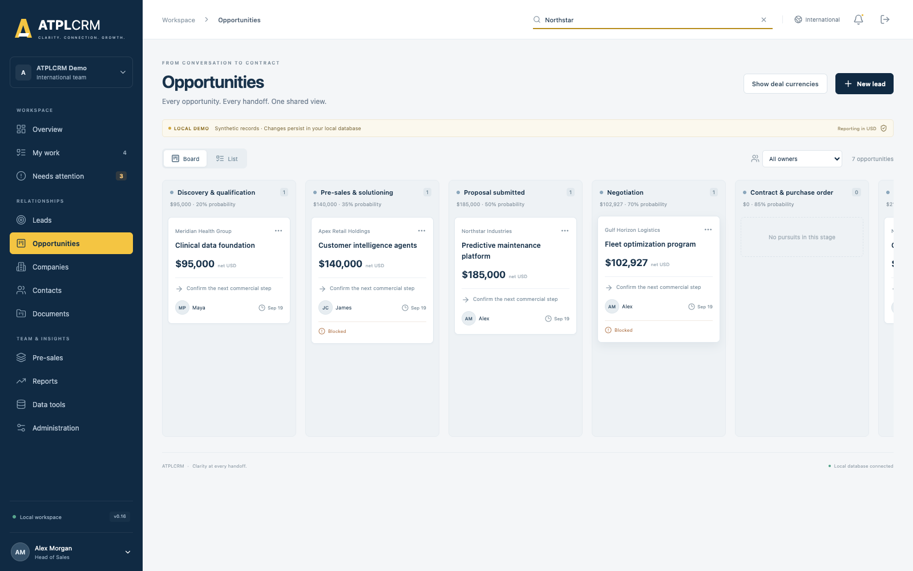
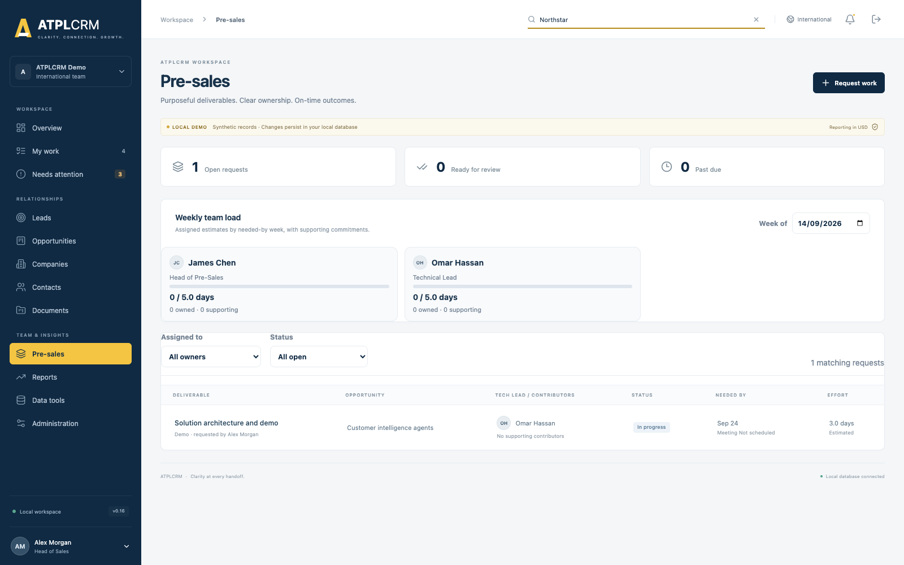
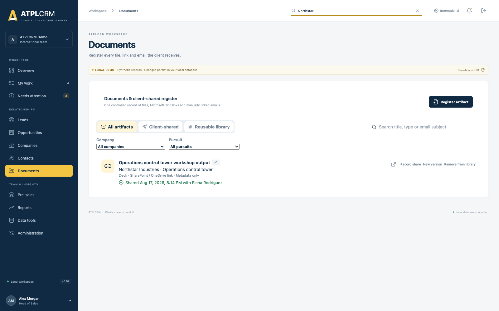
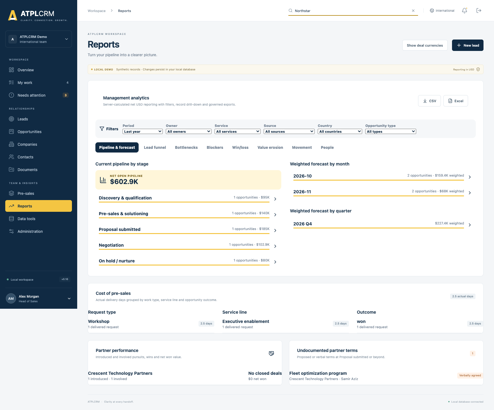
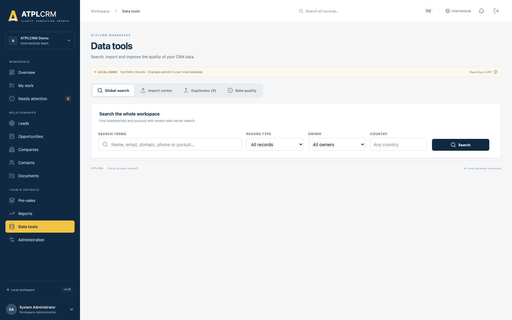
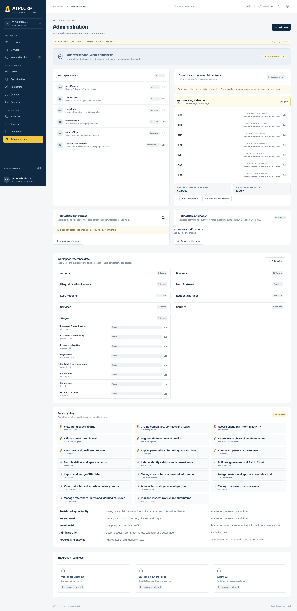

# ATPLCRM v0.16 Complete Client Demo Handbook

**Product:** ATPLCRM  
**Release:** v0.16 local client-demo release  
**Deployment demonstrated:** International Docker workspace  
**Primary URL:** http://localhost:8082  
**Companion US URL:** http://localhost:8083  
**Audience:** Presenter, administrator, sales leadership, pre-sales leadership, client reviewers and implementation stakeholders  
**Data classification:** Synthetic demonstration data only

> **Presenter message:** ATPLCRM provides one governed workspace for the sales journey from company and contact discovery through lead qualification, opportunity execution, pre-sales delivery, commercial closure and management reporting. At every point it makes ownership, the next action, blockers, evidence and history visible.

---

## 1. What this demonstration proves

ATPLCRM is a standalone CRM built with React and TypeScript, FastAPI, PostgreSQL, Redis/Celery and Docker. The current local release demonstrates the implemented business workflows without depending on Azure or Microsoft tenant access.

The system answers six daily questions:

1. What relationships and pursuits exist?
2. Where is each lead or opportunity in its lifecycle?
3. Who owns the commercial outcome, who has the Ball in Court, and who owns any blocker?
4. What must happen next, and by when?
5. What has been sent to or discussed with the client?
6. What is the gross, partner-adjusted and weighted value of the pipeline?

### End-to-end business flow


**Company and contact → Lead → Independent validation → Opportunity → Pre-sales and evidence → Commercial close → Delivery handoff and reporting**

The lead and opportunity populations remain separate. A lead enters the forecast only after an independent manager validates and converts it. Conversion preserves the original source, contacts, interactions, documents, responsibility history and lifecycle timestamps.



---

## 2. Demo boundaries and language to use

This is a client-demo-ready local release using synthetic data and local password authentication.

### Implemented in the local demonstration

- Complete company, contact, lead, opportunity, activity, action, blocker and relationship workflows.
- Governed lead validation and history-preserving conversion.
- Opportunity stages, seven lifecycle milestones and concurrency protection.
- Pre-sales request delivery, evidence, capacity and cost reporting.
- Document, Microsoft-link and selected-email registration workflows.
- Partner terms, local currencies, stored exchange rates, net values and value history.
- Universal search, imports, duplicate handling and data-quality management.
- Role dashboards, management analytics, record drill-down and CSV/Excel exports.
- Notifications, reminders, escalation rules and scheduled automation monitoring.
- Separate International and US Docker deployments.

### Later connected-deployment work

- Microsoft Entra ID single sign-on and user provisioning.
- Live Microsoft Graph, Outlook, SharePoint, OneDrive and Azure Blob adapters.
- Azure deployment, Key Vault, production observability and production backup acceptance.
- Azure OpenAI assistance and its review/evaluation controls.
- Production accessibility certification, connected-scale reconciliation and production security hardening.

Do not describe local passwords, synthetic companies, seeded exchange rates, local file storage or registered Microsoft links as live production integrations.

---

## 3. Accounts and role-based demo personas

All demo users use the local password stored in `DEMO_PASSWORD` in the applicable environment file. Never show or read the password aloud.

| Persona | Account | Best features to demonstrate |
|---|---|---|
| Administrator | `admin@atplcrm.local` | Users, permissions, references, currencies, working calendar, automation, imports, duplicates and data quality |
| Head of Sales / Manager | `alex@atplcrm.local` | Lead validation, pipeline, assignment, commercial controls, reports and approvals |
| Account Executive / Standard | `maya@atplcrm.local` | Personal work, owned relationships, activities, leads and assigned opportunities |
| Head of Pre-Sales / Manager | `james@atplcrm.local` | Pre-sales queue, assignment, review, capacity and cost |
| Technical Lead / Standard | `omar@atplcrm.local` | Accepting and completing assigned pre-sales work |
| Executive | `sarah@atplcrm.local` | Executive dashboard, complete reporting, restricted values and alternate validation |

### Role principles

- **Administrator:** manages workspace configuration and local users.
- **Executive:** has broad visibility and management controls.
- **Manager:** validates leads, reassigns work, manages probability/restriction decisions and approves client sharing.
- **Standard:** creates and works records according to ownership and pursuit-team roles.
- Record-level roles include sourced by, commercial owner, Ball in Court holder, blocker owner, pre-sales owner, tech lead and supporting contributor.
- Restricted commercial data remains visible only to permitted management and assigned pursuit participants.

---

## 4. Presenter preparation

### 4.1 Verify the International workspace

From `/Users/n22/Desktop/ATPLCRM`:

```sh
python3 scripts/demo.py status --instance INTERNATIONAL
docker compose --env-file .env ps
curl http://localhost:8082/api/health/
```

Expected API version: `0.16.0`. Open http://localhost:8082.

### 4.2 Verify the US workspace when comparing editions

```sh
python3 scripts/demo.py status --instance US
docker compose --env-file .env.us ps
curl http://localhost:8083/api/health/
```

The deployments have independent databases, users, sessions, files and queues. The International workspace supports several deal currencies with USD reporting. The US workspace is USD-only.

### 4.3 Browser setup

- Use a desktop browser at 100% zoom for the primary walkthrough.
- Keep a private/incognito window ready for a second persona.
- Use separate browser profiles when showing two simultaneous users; signing into another account in the same profile rotates the session and CSRF cookie.
- Close unrelated tabs and hide browser download history.
- Avoid changing important showcase records during rehearsal unless you plan to reset afterward.

### 4.4 Safe backup and reset

Create a backup before a session that will modify data:

```sh
python3 scripts/demo.py backup --instance INTERNATIONAL
```

Reset only when you intentionally want to replace local demo data. The guarded command creates a backup first and requires an exact confirmation:

```sh
python3 scripts/demo.py reset --instance INTERNATIONAL --confirm RESET-ATPLCRM
```

For the US environment, replace `INTERNATIONAL` with `US`.

---

## 5. Navigation and interface orientation

The left navigation is organized into three groups. The menu scrolls independently on shorter screens, while workspace and profile controls stay available.



| Group | Screen | Purpose |
|---|---|---|
| Workspace | Overview | Role-specific summary, headline metrics, clickable pipeline/forecast/funnel visuals and recently opened records |
| Workspace | My Work | Personal overdue, today and upcoming actions; blockers; assigned pre-sales deliverables |
| Workspace | Needs Attention | Cross-workspace exception queue for risks, delays and missing follow-up |
| Relationships | Leads | Unqualified relationship board/list and validation lifecycle |
| Relationships | Opportunities | Qualified commercial pipeline board/list |
| Relationships | Companies | Organization records and Company 360 |
| Relationships | Contacts | People, consent, engagement and interaction history |
| Relationships | Documents | Evidence, files, links, selected emails, sharing and asset library |
| Team & Insights | Pre-sales | Delivery queue, assignment, capacity and cost |
| Team & Insights | Reports | Pipeline, forecast, funnel, bottleneck, outcome and performance analytics |
| Team & Insights | Data tools | Global search, imports, duplicates and data quality |
| Team & Insights | Administration | Users, access rules, references, rates, calendar and automation |

### Top bar and global search

- Use the top search field from any screen.
- Press **Cmd+K** on macOS or **Ctrl+K** on Windows/Linux to focus it.
- Enter at least two characters.
- Results include companies, contacts, leads and opportunities, with type, status and owner.
- Select a result to open it directly. Records outside the bounded board dataset are fetched from the complete server list first.
- Select **View all results** to continue in Data tools with the search term carried across.
- Recently opened records appear on Overview and are private to the browser/user context.



### Common interaction patterns

- Click a dashboard number or visual bar to drill into its records.
- Use **Board/List** on Leads and Opportunities.
- List filters and current page are preserved when navigating away and returning.
- Use personal saved views for reusable filters.
- Detail panels provide a clear **Back to…** action and a close button.
- Loading skeletons and progress indicators show when data or exports are being prepared.
- Buttons are disabled while a submission or export is running to prevent duplicate actions.

---

## 6. Recommended complete client walkthrough

The full route takes approximately 55–70 minutes. For a 30-minute meeting, use sections 6.1–6.8 and demonstrate one representative record in each area.

### 6.1 Sign-in, role dashboard and global search — 5 minutes

**Account:** `alex@atplcrm.local`

1. Sign in to the International workspace.
2. Point out the International instance indicator and Local Demo ribbon.
3. Explain Alex’s role-specific dashboard cards.
4. Click a headline metric and return.
5. Show the pipeline-at-a-glance chart, weighted forecast and lead lifecycle visual.
6. Click a visual bar to demonstrate drill-through.
7. Press Cmd/Ctrl+K, search `Northstar`, and open a result.
8. Return to Overview and show **Recently opened**.

**Explain:** Different roles see relevant dashboard cards. All figures remain permission-aware. The dashboard is operational: cards and charts lead to records rather than presenting static totals.

**Expected result:** Search opens the selected company/contact/pursuit; dashboard navigation preserves context and no page reload is required.

### 6.2 My Work, responsibility and exception management — 6 minutes

1. Open **My Work**.
2. Show overdue, due-today and upcoming actions.
3. Show blockers owned by the current user and assigned pre-sales deliverables.
4. Open a pursuit and identify:
   - Commercial owner.
   - Ball in Court holder.
   - Next action, action type and due date.
   - Blocker, blocker owner and resolution action.
5. Use **Complete action** to demonstrate the atomic handoff concept: completing the current action requires a new holder, new action, action type and future date.
6. Open **Needs Attention** and explain each exception category.

**Explain:** Commercial accountability, immediate responsibility and obstacle ownership are deliberately separate. Completing an action never leaves a pursuit without a next step.

**Expected result:** The completed action becomes immutable history; the next action becomes current; notifications and exception queues update after refresh.

### 6.3 Companies, contacts and relationship history — 7 minutes

1. Open **Companies** and show the complete server-paginated list.
2. Search/filter, change sorting, export if useful, and save a personal view.
3. Open **Northstar Industries**.
4. In Company 360, show company details, contacts, active/closed pursuits and paginated interactions.
5. Open a related contact.
6. Show job information, communication details, source, sourced-by user, owner, consent basis, engagement status, do-not-contact status and engagement counters.
7. Add or edit a contact if the audience wants to see data entry.
8. Log a backdated client interaction or internal note.

**Explain:** Client-facing activity updates first/last-touch and engagement measures. Internal notes remain internal and do not make a relationship appear recently contacted. Do-not-contact blocks outbound logging unless the user records an override reason. Logging outreach to another owner’s contact shows the previous context and creates a durable owner notification.

**Expected result:** Company and contact timelines reflect the saved interaction; ownership and source attribution remain visible.

### 6.4 Lead lifecycle, drag and drop, and independent validation — 8 minutes

1. Open **Leads** in Board view.
2. Explain statuses: New, Working, Engaged, Ready for validation and Closed.
3. Drag an editable lead between active status columns.
4. Explain why **Closed** is protected from drag-and-drop: conversion, nurture and disqualification require dedicated evidence.
5. Switch to List view and demonstrate owner, holder, status, priority, source, dates and advanced filters.
6. Save a personal view or demonstrate filter persistence.
7. Open a lead and show source, original source person, company, contacts, next action, blocker and timeline.
8. Demonstrate **Nurture** with a revisit date or explain the independent disqualification route.
9. Move a lead to Ready for validation.
10. Explain that the source person and commercial owner cannot validate their own lead.
11. As an eligible Manager/Executive, choose **Validate & convert**.
12. Enter customer need, scope, primary contact, initial estimate, currency for International, service line and expected signature date.



**Explain:** A converted lead remains closed and traceable. Conversion creates exactly one linked opportunity and carries forward its relationship context, source, contacts, interactions, documents and timestamps.

**Expected result:** The new opportunity opens in Discovery; the original lead shows Converted and cannot be converted again.

### 6.5 Opportunity execution and lifecycle governance — 10 minutes

1. Open **Opportunities** in Board view.
2. Explain the stages:
   - Discovery and qualification.
   - Pre-sales and solutioning.
   - Proposal submitted.
   - Negotiation.
   - Contract and purchase order.
   - Closed won.
   - Closed lost.
   - On hold/nurture.
3. Drag an editable opportunity to another valid stage.
4. Show the stage evidence prompt and explain that backward movement is allowed and audited.
5. Explain advanced gates: pre-sales owner and tech lead are required from the relevant point; proposal movement warns when no artifact is registered; terminal outcomes use dedicated forms.
6. Open an opportunity and show the at-a-glance summary.
7. Edit customer need, scope, primary contact, service line, opportunity type, engagement type or close date where permitted.
8. Show pursuit team roles and stakeholder roles. Add/edit a stakeholder and explain same-company and primary-contact protections.
9. Show next action completion and blocker resolution.
10. Show probability, stage default and manager override with mandatory explanation.
11. Open **Timeline** and point out immutable action, assignment, stage, value, document and audit events.
12. Show the seven milestones: lead created, first contact, ready for validation, validated, pre-sales assigned, proposal sent and closed.



**Concurrency explanation:** Stage moves and assignment changes carry record versions. If another session updates the same pursuit first, the stale change is rejected and the user is asked to refresh rather than silently overwriting the newer state.

### 6.6 Commercial values, currencies, partners and closure — 8 minutes

1. Open the opportunity’s **Commercial** tab.
2. Show gross value, partner deductions, net forecast value, partner share, stored FX rate and probability.
3. Use **Show deal currency / Show USD**.
4. Add a value-history entry such as Revised proposal or Negotiated value.
5. Show that prior values remain append-only with amount, currency, stored rate, USD amount, author, date and note.
6. Show a partner involvement: company/contact, role, introduced flag, fee basis, partner-takes percentage/fixed amount, applicable scope/duration, status, evidence and notes.
7. Explain the configurable partner-share warning and undocumented-term reporting.
8. Demonstrate or explain an opportunity-specific FX-rate update with reason.
9. Explain Hold, Closed Lost and Closed Won:
   - Hold requires a revisit date and is excluded from forecast.
   - Lost requires loss reason and competitor context where known.
   - Won captures final value, contract/PO number/date, project start, duration, final evidence and optional delivery handoff notes.

#### International currency workflow

- Administrators edit reference rates under **Administration → Currency and commercial controls**.
- Available demo currencies are USD, AED, SAR, INR, BHD, EUR and GBP.
- Currency is selected during lead validation/conversion.
- The reference rate is copied to the opportunity and remains fixed for reproducible history.
- A global rate change affects new opportunities only.
- Authorized users can update one opportunity’s stored rate with a reason.
- Administrators can deliberately re-baseline selected open opportunities.
- Management reporting uses net USD while users can display the original deal currency.

#### US workspace difference

The US deployment permits USD only and hides the International currency selector/toggle. It has its own database and does not share history with the International deployment.

### 6.7 Pre-sales delivery — 7 minutes

1. Open **Pre-sales**.
2. Show open requests, filters and weekly team capacity.
3. Open a request and explain the workflow:
   - Requested.
   - Clarification required.
   - Accepted.
   - In progress.
   - Ready for review.
   - Approved to share.
   - Delivered.
   - Blocked or Cancelled when applicable.
4. Show Head of Pre-Sales assignment, tech-lead acceptance and supporting contributors.
5. Show request type, description, needed-by date, client meeting date, blocker, estimated days and notes.
6. Demonstrate the evidence and manager-approval gate before client sharing.
7. Show named delivery recipients and actual effort.
8. Explain weekly capacity and actual-day cost analysis by request type, service line and opportunity outcome.



**Expected result:** A Delivered request contains approved evidence, recipients and actual effort; assigned work also appears in My Work.

### 6.8 Documents, selected email and client-shared register — 7 minutes

1. Open **Documents**.
2. Show the searchable artifact library and classification filters.
3. Demonstrate the three registration methods:
   - Managed private file upload.
   - SharePoint/OneDrive link registration.
   - Selected Outlook email registration.
4. Show artifact type, title, classification, version, internal-only setting and linked company/pursuit.
5. Explain that selected-email metadata includes message reference, subject, date, direction and participants; selected attachments can be registered automatically.
6. Show manager approval, named client recipients and sharing timestamp.
7. Show version replacement and the superseded marker.
8. Explain company and opportunity client-shared registers.
9. Show reusable assets independent of the originating pursuit.



**Local boundary:** Managed files use a private Docker volume. Microsoft links and selected-email metadata demonstrate the CRM workflow; live Graph/SharePoint access requires later tenant configuration.

### 6.9 Reports and management review — 8 minutes

1. Open **Reports** as Alex, Sarah or another management user.
2. Apply period, owner, service, source, country and opportunity-type filters.
3. Demonstrate each report tab:

| Report | What it answers |
|---|---|
| Pipeline & forecast | Net open pipeline by stage and weighted forecast by month/quarter |
| Lead funnel | Created, worked, engaged, validated, disqualified and converted leads; source/user breakdown |
| Bottlenecks | Count and median working days across seven lifecycle transitions |
| Blockers | Open blockers by type and owner, with median and oldest age |
| Win/loss | Win rate, average deal size, cycle time and loss reasons by grouping |
| Value erosion | Initial versus final value by service line or owner |
| Movement | Pursuits entering, advancing, regressing, closing or slipping in the selected period |
| People | Leads generated, opportunities owned, pre-sales delivered, current Ball in Court and blockers owned |

4. Click a row or total to open governed underlying records.
5. Open one record from the drill-down.
6. Export the current report to CSV and Excel and point out the progress indicator.
7. Show partner performance, undocumented partner terms and pre-sales cost panels where available.



**Explain:** Pipeline and forecast use server-calculated net USD values. On-hold opportunities are excluded from forecast. Drill-down and exports follow the same tenant, role and restricted-value rules as the screen.

### 6.10 Search, import, duplicates and data quality — 8 minutes

**Account:** Alex for management tools or Admin for complete access.

1. Open **Data tools → Global search**.
2. Search by company, person, email or pursuit; filter by type, owner, status and country.
3. Show ranked exact/prefix results, paging and private recent-search history.
4. Open **Import center**.
5. Choose Companies, Contacts or Leads and download the template.
6. Upload CSV or Excel, map columns and run the dry-run validation.
7. Explain required fields, row errors, within-file duplicates and warnings against existing records.
8. Download the error file when applicable.
9. Confirm fuzzy warnings only after review, then import valid rows.
10. Show durable import history with imported/skipped totals and errors.
11. Open **Duplicates**, review exact/fuzzy company/contact groups, choose the primary record, select field-by-field values and merge—or mark the records as reviewed distinct.
12. Open **Data quality**, filter by severity/type, review recommended actions, open a record and export the queue.



**Limits:** Imports accept CSV and `.xlsx`, support mapped complete company/contact/lead fields, and enforce the configured 20,000-row maximum. Standard users can search but cannot use management data-quality operations.

### 6.11 Administration and automation — 8 minutes

**Account:** `admin@atplcrm.local`

1. Open **Administration**.
2. Show local users, access level, job title, active/inactive status and weekly pre-sales capacity.
3. Add a user or edit an existing user. Explain optional password reset and session invalidation.
4. Show the access-policy/capability matrix and field rules.
5. Show reference lists for sources, services, actions, blockers, loss/disqualification reasons and their order/availability.
6. Show controlled stage labels and default probabilities.
7. Open **Currency and commercial controls**:
   - Explain USD reporting base.
   - Edit one reference rate and source if appropriate.
   - Explain that reference rates affect new opportunities.
   - Show partner-share warning and FX movement threshold.
8. Configure the working calendar and holidays used by lifecycle timing.
9. Show notification preferences, threshold controls, recipient/escalation rules and automation status.
10. Explain 15-minute exception scans, Monday leadership summaries, exchange-rate refresh status and failure alerts.
11. Show Integration readiness cards for Entra ID, Outlook/SharePoint and Azure AI, clearly marked as not connected.



### 6.12 Non-admin and restricted-data proof — 5 minutes

Use a private browser window and sign in as `maya@atplcrm.local`.

1. Show Maya’s individual-contributor dashboard.
2. Open My Work and an assigned pursuit; demonstrate permitted updates.
3. Open Administration and show the read-only/reduced policy view.
4. Open Data tools and show that universal search is available while import, duplicates and data-quality management are unavailable or forbidden.
5. Open a restricted opportunity where Maya has no pursuit role.
6. Point out that commercial values and sensitive narrative are withheld while allowed relationship context remains available.

**Explain:** The UI reflects permissions for usability, and the API independently enforces every protected operation and field response.

---

## 7. Detailed functionality reference by screen

### 7.1 Overview

- Role-specific cards for Executive, Head of Sales, Head of Pre-Sales and individual contributors.
- Open pipeline, weighted forecast, active leads and Needs Attention metrics.
- Clickable pipeline-by-stage chart.
- Clickable weighted forecast by close month.
- Clickable lead lifecycle funnel.
- Personal focus panel for due today, overdue and owned blockers.
- Attention table and recent interaction context.
- Recently opened records.
- Loading skeleton while server-calculated role data is prepared.

### 7.2 My Work

- Overdue, today and upcoming actions assigned through Ball in Court.
- Blockers owned by the user.
- Assigned pre-sales deliverables.
- Direct record opening.
- Atomic action completion and next-step handoff.

### 7.3 Needs Attention

- Missing or overdue next action.
- Responsibility held longer than the configured threshold.
- Open/aged blocker.
- No recent client interaction.
- Validation delay.
- Proposal follow-up delay.
- Approaching/passed expected close date.
- Approaching/overdue pre-sales deliverable.
- Nurture/hold revisit dates.
- Direct drill-through to the affected pursuit.

### 7.4 Leads

- Separate board and complete server list.
- Drag-and-drop across active statuses with a detail selector fallback.
- Closed status protected for evidence-based conversion, nurture or disqualification.
- Company, owner, holder, source, source details, sourced-by, priority and area of interest.
- Mandatory next action, action type and future due date.
- Blocker and blocker-owner workflow.
- Owner/holder/status/source/priority/date/activity filters, sorting and personal views.
- Management bulk owner/Ball-in-Court reassignment with reason and version protection.
- Independent validation routing, explicit eligible validators and self-validation refusal.
- One-time, history-preserving conversion.

### 7.5 Opportunities

- Board and complete server list.
- Drag-and-drop and accessible stage selector.
- Stage evidence and automatic milestone timestamps.
- Forward and backward movement with audit history.
- Required team roles at governed stages.
- Editable qualified fields and close date.
- Commercial owner, Ball in Court, pursuit team and blocker owner.
- Stakeholder roles with same-company validation.
- Atomic actions and immutable completed-action history.
- Probability default and explained management override.
- On-hold exclusion from forecast.
- Won/lost evidence capture and sales-to-delivery handoff.
- Optimistic concurrency on stage and assignment changes.
- Restricted commercial visibility.

### 7.6 Companies

- Create/edit organization, type, industry, country, domain, owner, primary region and global-account name.
- Full paginated/sortable/filterable list and export.
- Company 360 with contacts, all pursuits and combined activity history.
- Duplicate warning and governed merge through Data tools.

### 7.7 Contacts

- Complete communication, role, seniority, address and social fields.
- Owner and permanent source attribution.
- Source channel/detail and consent basis.
- Engagement status, first/last touch and outbound count.
- Do-not-contact control with retained override reason.
- Associated pursuits and full paginated interaction history.
- Ownership collision warning and notification.

### 7.8 Activities

- Email, call, LinkedIn message/request, WhatsApp, meeting, demo, workshop, event conversation and internal note.
- Inbound/outbound/internal direction, outcome, subject, notes and backdated date.
- Optional company, contact, pursuit and artifact relationship.
- Client-facing derivation prevents internal work from refreshing client-interaction metrics.
- Fast entry from relationship or pursuit context.

### 7.9 Documents

- Private managed uploads and protected downloads.
- SharePoint/OneDrive link registration.
- Selected-email metadata and automatic attachment artifact registration.
- Artifact types, classifications, versioning and supersession.
- Internal-only control.
- Manager approval and named-recipient sharing.
- Company/opportunity shared registers.
- Search and reusable asset library.
- Outlook task-pane package for connected deployment preparation.

### 7.10 Pre-sales

- Governed request creation only on qualified opportunities.
- Head assignment, tech-lead acceptance and contributors.
- Nine-state workflow including blocked/cancelled.
- Needed-by date, client meeting, blockers and estimated/actual effort.
- Evidence-backed review, manager approval and client-sharing gates.
- Named delivery recipients.
- Weekly capacity by person and delivered-effort cost analysis.

### 7.11 Reports

- Shared period and business filters.
- Server-calculated net USD values.
- Current pipeline and weighted forecast.
- Historical lead funnel and seven-transition bottlenecks.
- Blocker ageing, outcomes, loss reasons, value erosion and movement.
- Individual contribution.
- Partner performance and undocumented partner terms.
- Pre-sales cost.
- Governed record drill-down.
- CSV and Excel export with visible progress.

### 7.12 Data tools

- Universal full-text search and private recent searches.
- CSV/Excel templates, mapping, dry run and import.
- Partial success, warning confirmation and downloadable errors.
- Durable import history.
- Exact/fuzzy company/contact duplicate groups.
- Field-level merge and reviewed-distinct dismissal.
- Quality score, severity/type filters, recommended actions and export.

### 7.13 Administration

- Local user create/edit/deactivate and password reset.
- Access levels, capability contract and field rules.
- Configurable reference labels, ordering and availability.
- Stage default probabilities.
- Exchange-rate reference table and source.
- Opportunity-specific FX update and selected-open-deal re-baseline.
- Partner-share and FX-movement thresholds.
- Working weekdays and holidays.
- Notification preferences, escalation rules and automation health.
- Readiness status for future Microsoft/Azure integrations.

### 7.14 Notifications

- Durable in-app inbox and read state.
- Preference controls and thresholds per user.
- Due/overdue actions, missing next steps, long-held responsibility, aged blockers and stale contact.
- Validation, proposal follow-up, pre-sales deadline, close-date and revisit reminders.
- Scheduled leadership summary.
- Exchange-rate refresh failures/movement alerts.
- Recipient/escalation rules route notices to responsible owners and function heads.

### 7.15 Lists, exports and scale behavior

- Server-side pagination, filtering and sorting for companies, contacts, leads and opportunities.
- Personal saved views.
- Filter state and current page preserved during navigation.
- Manager bulk assignment.
- CSV/Excel downloads with formula-injection-safe server output.
- Boards use the 100 most recently updated pursuits when the working set is large.
- Complete lists and global search remain available for older records.
- A disposable benchmark has exercised 20,006 contacts, 5,000 leads and 5,000 opportunities.

### 7.16 Responsive and accessibility behavior

- Responsive desktop and phone layouts.
- Scrollable desktop/mobile side navigation.
- Keyboard-accessible global search and stage selector fallback.
- Visible focus behavior, semantic labels and reduced-motion support.
- Status announcements for loading, errors and results.
- Mobile users can search relationships, log activity, update status/stage, manage actions and review My Work.

### 7.17 Authentication, session, audit and tenant safety

- Local demo sign-in uses per-workspace accounts and the generated `DEMO_PASSWORD`; passwords and secrets are excluded from Git.
- Sessions use secure cookie-based authentication with a 12-hour sliding inactivity window.
- Five repeated failures for an account/address trigger temporary throttling without confirming whether an account exists.
- CSRF protection applies to state-changing requests; the client performs one safe token refresh/retry when another tab has rotated the cookie.
- Signing out removes the session; disabling or resetting a user invalidates their active access.
- Every API query is tenant-scoped. International and US data, sessions, files and queues are isolated.
- Role and record permissions are enforced by FastAPI even if someone bypasses or modifies the browser interface.
- Audit events cover creation and material workflow changes. Value/action history is append-only, and database triggers protect audit/value history from ordinary update/delete operations.
- Application and web containers run as non-root users; PostgreSQL, Redis queue state and artifacts use persistent Docker volumes.
- Startup runs database migrations before the API becomes healthy. API, database, Redis and web health checks govern service readiness.
- Guarded backups and reset commands protect demonstration data; production backup retention and restore acceptance remain later deployment work.

---

## 8. Suggested demo stories by audience

### Sales leadership

Start at Overview → Needs Attention → Opportunities → Commercial → Reports. Focus on pipeline truth, owner/holder clarity, blocker age, forecast confidence, value erosion and drill-down.

### Sales users

Start at My Work → Contact → Log activity → Lead → Drag status → Complete action. Focus on a quick daily workflow and shared relationship memory.

### Pre-sales leadership

Start at Pre-sales → Capacity → Request detail → Evidence/approval → Cost report. Focus on intake discipline, assignment, workload and measurable delivery effort.

### Executive audience

Start at the Executive dashboard → Forecast → Win/loss → Movement → People. Focus on trusted net USD reporting, transparent assumptions and direct access to supporting records.

### Administrator / IT audience

Start at Administration → Access policy → Users → Currency/calendar → Data tools → Automation → Docker health. Focus on governance, tenant boundaries, configuration and operational control.

---

## 9. Presenter recovery and troubleshooting

| Symptom | Recovery action |
|---|---|
| CSRF validation failed during sign-in | Reload once and sign in again. Avoid two accounts in the same browser profile. The client also performs one automatic CSRF refresh/retry. |
| Too many failed sign-ins | Wait for the displayed retry period or use another documented demo account. |
| Record is not visible on a board | Use global search or the complete List view; boards intentionally use the bounded recent working set at scale. |
| Lead will not drop into Closed | Use Convert, Nurture or Disqualify so required evidence is captured. |
| Opportunity stage move is rejected | Read the validation message; add required team, dates, evidence or closure fields. Refresh if another user changed the record. |
| Restricted values are hidden | Use an assigned pursuit participant or management persona; do not bypass the policy. |
| Report is still calculating | Wait for the loading skeleton to resolve; reduce the date/filter scope if demonstrating a very large dataset. |
| Export button is disabled | An export is already being prepared. Wait for the browser download. |
| Docker service is unhealthy | Run `docker compose --env-file .env ps` and `docker compose --env-file .env logs --tail=100 api worker scheduler`. Preserve volumes. |
| A clean rehearsal is required | Back up, then use the guarded `scripts/demo.py reset` command with exact confirmation. |

---

## 10. Questions clients commonly ask

**Can one user access both International and US?**  
The deployments are independent. A person needs an account in each, and there is no automatic shared history or combined report.

**Can we use another International currency?**  
The demo contains USD, AED, SAR, INR, BHD, EUR and GBP. Administrators can edit their rates. Adding a new ISO currency through the UI is a later configuration enhancement.

**Does a reference-rate change revalue every deal?**  
No. Each opportunity stores its rate for reproducibility. Global rates affect new opportunities; selected open deals can be deliberately re-baselined with confirmation and audit.

**Does ATPLCRM automatically read everyone’s mailbox?**  
No. Email linking is intentionally user-selected. The local build demonstrates registration; live Outlook/Graph access is a later tenant integration.

**Can a salesperson approve their own lead?**  
No. Validation is independent. The lead’s source person and commercial owner cannot be the validator.

**Can users skip the next action?**  
No active pursuit should be left without a holder, action, type and date. Completing an action requires the next step in the same operation.

**Does drag-and-drop bypass controls?**  
No. It calls the same governed server workflow as the accessible selector. Evidence, role, stage and concurrency checks still apply.

**Are reports based on gross or net value?**  
Management pipeline and forecast use ATPLCRM’s net value in USD after partner deductions. Gross/local values remain available for context when permitted.

**Is AI included?**  
No simulated AI is presented. The planned Azure OpenAI features require approved deployment, grounding, explicit user acceptance and evaluation.

**Is this production-ready?**  
It is a complete local demonstration baseline. Connected identity, Microsoft/Azure services, production security/operations and production acceptance remain separate work.

---

## 11. Demo completion checklist

### Before the meeting

- [ ] International containers are running and healthy.
- [ ] API reports version 0.16.0.
- [ ] Administrator and presenter accounts can sign in.
- [ ] Browser is at 100% zoom with unrelated tabs closed.
- [ ] A backup exists before any data-changing rehearsal.
- [ ] Download folder is clear of older client/demo exports.
- [ ] Private window is ready for the non-admin comparison.

### During the meeting

- [ ] State that records and rates are synthetic.
- [ ] Show owner, Ball in Court, next action and blocker early.
- [ ] Demonstrate one governed transition rather than only viewing screens.
- [ ] Show drill-down from a dashboard/report to its source record.
- [ ] Show at least one role difference.
- [ ] Clearly identify Microsoft/Azure features as later connected integrations.

### After the meeting

- [ ] Sign out of all browser windows.
- [ ] Remove downloaded exports if they contain newly entered information.
- [ ] Record requested changes with role, screen, exact action and desired result.
- [ ] Keep volumes for follow-up continuity or perform a guarded reset before the next clean rehearsal.

---

## 12. Final presenter close

Use this close with clients:

> “ATPLCRM gives sales, pre-sales and leadership one shared record of every relationship and pursuit. It separates unqualified leads from trusted pipeline, makes the next responsible person and action explicit, preserves evidence and history, and turns the same governed data into operational work queues and management reporting. This local release demonstrates the full workflow; the next deployment stage connects enterprise identity, Microsoft services and Azure operations.”

