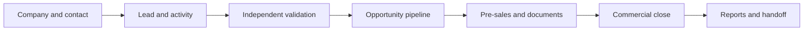

# ATPLCRM Local Client Demo Guide

**Release:** v0.16 local demo readiness

**Audience:** presenter, administrator and client reviewers

**Deployment:** Docker Compose on the presenter's computer

For the complete screen-by-screen narrative, role walkthroughs and current visuals, use [ATPLCRM v0.16 Complete Client Demo Handbook](ATPLCRM_v0.16_COMPLETE_DEMO_HANDBOOK.md). An editable Word edition is available at `docs/ATPLCRM_v0.16_Complete_Client_Demo_Handbook.docx`.

## 1. What this demo proves

ATPLCRM supports the complete local CRM flow from a new relationship through lead validation, opportunity delivery and management reporting. The demo uses synthetic data. It includes role-based access, searchable records, data-quality tools, documents, pre-sales, commercial terms, notifications and exports.

Connected Microsoft Entra ID, Microsoft Graph, Azure storage and Azure OpenAI are later deployment integrations. Do not describe local passwords, synthetic exchange rates or local document storage as production services.



## 2. Presenter preparation

From `/Users/n22/Desktop/ATPLCRM`:

```sh
python3 scripts/demo.py status --instance INTERNATIONAL
python3 scripts/demo.py backup --instance INTERNATIONAL
docker compose ps
```

Open <http://localhost:8082>. Use the shared local password stored as `DEMO_PASSWORD` in `.env`. Never display or read that value aloud. Recommended accounts:

| Persona | Account | Use in the demo |
|---|---|---|
| Administrator | `admin@atplcrm.local` | Users, access policy, reference data, data tools and automation |
| Sales manager | `alex@atplcrm.local` | Pipeline, validation, commercial controls, reports and approvals |
| Sales user | `maya@atplcrm.local` | Personal work, relationships, activities and assigned pursuits |
| Pre-sales manager | `james@atplcrm.local` | Queue assignment, capacity and review |
| Technical contributor | `omar@atplcrm.local` | Acceptance, delivery work and evidence |
| Executive | `sarah@atplcrm.local` | Executive dashboard, forecast and governed reports |

Close private client information and unrelated browser tabs. Set browser zoom to 100%. Keep a second private window ready for the non-admin role comparison.

## 3. Safe data reset

Reset only when you intend to replace the local demo database. The tool requires an exact confirmation and creates a PostgreSQL backup first.

```sh
python3 scripts/demo.py reset --instance INTERNATIONAL --confirm RESET-ATPLCRM
```

The backup is written under `backups/` with mode `0600`. To skip the backup only for an explicitly disposable environment, add `--skip-backup`. The US instance is independent:

```sh
python3 scripts/demo.py status --instance US
python3 scripts/demo.py reset --instance US --confirm RESET-ATPLCRM
```

## 4. Recommended 30-minute walkthrough

### A. Sign-in and role policy — 3 minutes

1. Sign in as `admin@atplcrm.local`.
2. Open **Administration → Access policy**.
3. Show granted capabilities and field rules.
4. Explain the 12-hour sliding session and repeated-failure throttle.

Expected: the Administrator sees user, reference and automation permissions. Five failed attempts for one account/address cause a temporary lock; the UI reports a retry rather than revealing whether the account exists.

### B. Overview, My Work and alerts — 3 minutes

1. Open **Overview** and show the role-specific cards.
2. Open **My Work** for overdue, today, upcoming, blocker and deliverable queues.
3. Open **Needs Attention** and a notification.
4. Show notification preferences.

Expected: cards and queues open their governed underlying records; read state persists.

### C. Companies, contacts and activity — 4 minutes

1. Open **Northstar Industries** in Companies.
2. Review Company 360, contacts, pursuits and paginated interaction history.
3. Open a contact and show source, consent, engagement and do-not-contact fields.
4. Add a backdated activity or internal note.

Expected: client-facing activity updates engagement and last interaction; internal notes do not. A same-contact collision warns about the previous owner/touch and can still be saved with an audit trail.

### D. Lead lifecycle — 4 minutes

1. Open the lead board and one lead in each meaningful state.
2. Show source, Ball in Court, blocker and next action.
3. Demonstrate nurture or disqualification requirements.
4. Explain independent validation: the source/owner cannot self-validate; an eligible management user converts the lead once.

Expected: conversion retains the lead as closed and creates one linked opportunity with history, contacts and source intact.

### E. Opportunity pipeline — 5 minutes

1. Open **Predictive maintenance proposal**.
2. Show the seven milestones, stakeholders, team and immutable completed actions.
3. Complete an action and assign the next owner/action/date.
4. Move a stage using drag-and-drop or the accessible selector.
5. Explain version-conflict protection by noting that stale browser edits receive a refresh message.

Expected: stage evidence is enforced, pre-sales roles are required at later stages, timestamps update automatically and every change is audited.

### F. Pre-sales, documents and commercial terms — 5 minutes

1. Open the pre-sales queue and show requested, blocked/in-progress and delivered work.
2. Show assignment, tech-lead acceptance, contributors, evidence, approval and client delivery recipient.
3. Open Documents to show managed uploads, Microsoft links, selected-email registration, versions and reusable assets.
4. Open an opportunity with a partner and show fee basis, warnings, gross/net local value and fixed USD conversion.

Expected: document sharing requires the correct approval; delivered pre-sales work has evidence and recipient details; restricted values stay hidden from users without record access.

### G. Search, data tools and reports — 5 minutes

1. Open **Data tools → Search**, search `Northstar`, filter by record type/country/status and open a result.
2. Show recent searches, then clear them.
3. As an Administrator or Manager, show import preview/history, duplicate review and the data-quality queue.
4. Open Reports, change filters, drill into a figure and export CSV or Excel.

Expected: exact/prefix matches rank first; result paging works; recent history is private per user; Standard users see Search but cannot call management data endpoints; report totals and exports follow the same record/value rules.

### H. Non-admin proof — 1 minute

1. In the private window, sign in as `maya@atplcrm.local`.
2. Show the reduced Access policy and Search-only Data tools view.
3. Open an assigned pursuit and then a restricted pursuit where Maya is not on the team.

Expected: assigned work remains editable; management imports/quality/duplicates are forbidden; restricted commercial fields and narrative are withheld when policy requires it.

## 5. Presenter recovery

| Symptom | Action |
|---|---|
| Sign-in says CSRF validation failed | Reload the page once. The client refreshes the CSRF cookie and retries once; avoid logging into two accounts in the same browser profile. |
| Too many sign-in attempts | Wait for the displayed retry interval or use another documented demo account. Do not restart services to bypass the control. |
| A board does not show an old pursuit in a scale dataset | Boards intentionally show the 100 most recently updated pursuits. Use the complete list or global search. |
| A stage move is rejected | Read the evidence message, add the required team/evidence/closure values, refresh if another session changed the record, then retry. |
| Services are unhealthy | Run `docker compose ps`, then `docker compose logs --tail=100 api migrate db`. Preserve volumes unless a deliberate reset is approved. |

## 6. Demo close checklist

- Sign out of both browser windows.
- Confirm no exports containing client-entered information remain in Downloads.
- Record defects with role, record, exact action, expected result and observed result.
- Keep Docker volumes if the client wants a follow-up on the same data; use the reset command only before a clean rehearsal.

## 7. Local release boundaries

- Bindings are loopback-only and intended for an in-person/local-network controlled demo.
- Data, files, sessions, PostgreSQL and Redis persist in local Docker volumes.
- Exchange rates and all seeded companies/contacts are synthetic.
- Microsoft links are registered metadata; connected tenant access is not activated locally.
- Email/mobile notification delivery, Entra SSO, Azure deployment and AI assistance are outside this release.
