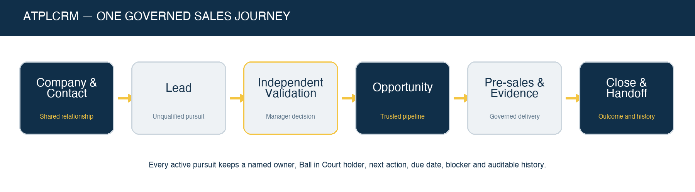
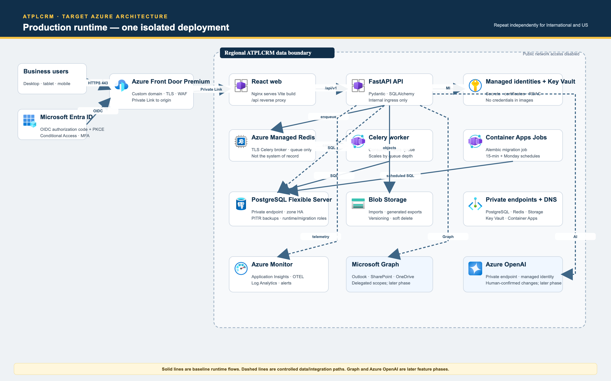

# ATPLCRM v0.16 Project Handoff

**Handoff date:** 30 September 2026  
**Repository:** `https://github.com/aegletek/atplcrm.git`  
**Local workspace:** `/Users/n22/Desktop/ATPLCRM`  
**Branch:** `main`  
**Product boundary:** Standalone ATPLCRM product; no Orbit source, runtime, credentials or data dependency  
**Current deployment target:** Local Docker Compose for client demonstrations  
**Future production target:** Microsoft Azure

## 1. Handoff summary

ATPLCRM v0.16 is a client-demo-ready local CRM covering the complete implemented flow from relationship capture through lead qualification, opportunity execution, pre-sales delivery, document evidence, commercial closure and management reporting.



Both local editions are deployed:

| Edition | URL | Environment file | Compose project | Currency behavior |
|---|---|---|---|---|
| International | `http://localhost:8082` | `.env` | `atplcrm-international` | USD reporting with USD, AED, SAR, INR, BHD, EUR and GBP deal currencies |
| United States | `http://localhost:8083` | `.env.us` | `atplcrm-us` | USD only |

The current API version is `0.16.0`. The Alembic head is `0013_demo_readiness`. PostgreSQL, Redis, artifacts and queues persist in separate Docker volumes for each edition.

## 2. Current product state

The local implementation includes:

- Role-aware Overview, My Work and Needs Attention screens.
- Cmd/Ctrl+K global command search, direct record opening and complete-result handoff.
- Recently opened records, preserved list filters/page and clear detail return navigation.
- Companies, contacts, consent, engagement, do-not-contact and collision warnings.
- Activity logging with client/internal separation and paginated histories.
- Lead board/list, active-status drag-and-drop, independent validation, nurture, disqualification and idempotent conversion.
- Opportunity board/list, governed drag-and-drop, accessible selector, concurrency protection and seven milestones.
- Atomic action completion, Ball in Court handoffs, blockers, team and stakeholders.
- Fixed deal currencies/rates, value history, probability override, partner terms, net values and complete Won/Lost/Hold capture.
- Pre-sales assignment, acceptance, contributors, review, evidence, delivery, capacity and cost.
- Managed uploads, Microsoft-link metadata, selected-email registration, attachments, versions, approval and client-shared registers.
- CSV/Excel import, dry run, mapping, partial results, duplicate review/merge and data-quality dashboard.
- Server-calculated pipeline, forecast, funnel, bottleneck, blocker, outcome, erosion, movement, people, partner and pre-sales reports.
- Permission-safe drill-down and CSV/Excel exports with visible progress.
- Local user/reference/rate/calendar administration, notifications and scheduled automation.
- Responsive UI with independently scrollable navigation and keyboard-accessible alternatives.

## 3. Technology and architecture

```text
Browser
  -> unprivileged Nginx web container
       -> React 19 + TypeScript + Vite static application
       -> same-origin /api reverse proxy
            -> FastAPI modular monolith
                 -> SQLAlchemy 2 + PostgreSQL 17 system of record
                 -> Redis 7 broker/state
                      -> Celery worker
                      -> Celery Beat scheduler

One-shot migrate container -> Alembic -> PostgreSQL
Private artifact volume -> FastAPI governed document routes
```

| Layer | Implementation |
|---|---|
| Web | React 19, TypeScript, Vite, custom ATPLCRM CSS, Lucide icons |
| API | FastAPI, Pydantic, SQLAlchemy |
| Database | PostgreSQL 17 with Alembic migrations and Decimal financial values |
| Background work | Celery 5.6 and Redis 7 |
| Local edge | Unprivileged Nginx serving the Vite build and proxying `/api` |
| Packaging | Docker Compose with `db`, `redis`, `migrate`, `api`, `worker`, `scheduler`, `web` |
| Tests | Pytest API workflows and Playwright browser acceptance |
| CI | `.github/workflows/ci.yml` |

Kafka is intentionally absent. Introduce Azure Event Hubs/Kafka only if a real ordered, replayable cross-service stream becomes necessary.

## 4. Repository map

```text
ATPLCRM/
├── apps/api/
│   ├── atplcrm/               FastAPI routes, models, services, security and tasks
│   ├── alembic/versions/      Database migrations through 0013_demo_readiness
│   └── tests/                 API and authorization workflows
├── apps/web/
│   ├── src/                   React application and components
│   └── tests/                 Playwright browser flows
├── docs/                      Status, plan, traceability, verification and handbooks
├── exports/                   Shareable plan and Azure architecture diagrams
├── infra/                     API/web Dockerfiles and Nginx configuration
├── scripts/                   Bootstrap, demo operations, backup and benchmark tools
├── compose.yaml
├── Makefile
└── README.md
```

Important frontend files:

| File | Responsibility |
|---|---|
| `apps/web/src/App.tsx` | Shell, dashboards, boards, detail workflows, administration and major forms |
| `apps/web/src/GlobalSearch.tsx` | Top-bar command search and keyboard shortcut |
| `apps/web/src/RecordList.tsx` | Server lists, filters, saved views, bulk assignment and export |
| `apps/web/src/ReportsCenter.tsx` | Management reports, drill-down and export |
| `apps/web/src/DataTools.tsx` | Search, import, duplicates and quality |
| `apps/web/src/DocumentCenter.tsx` | Artifacts, selected email, versions and sharing |
| `apps/web/src/styles.css` | Responsive ATPLCRM visual system |

Important API modules include `api.py`, `commercial.py`, `documents.py`, `notifications.py`, `presales.py`, `productivity.py`, `reporting.py`, `security.py`, `services.py`, `models.py` and `tasks.py`.

## 5. Local credentials and secrets

Seeded accounts:

| User | Email | Access level |
|---|---|---|
| System Administrator | `admin@atplcrm.local` | Administrator |
| Alex Morgan | `alex@atplcrm.local` | Manager / Head of Sales |
| Maya Patel | `maya@atplcrm.local` | Standard / Account Executive |
| James Chen | `james@atplcrm.local` | Manager / Head of Pre-Sales |
| Omar Hassan | `omar@atplcrm.local` | Standard / Technical Lead |
| Sarah Williams | `sarah@atplcrm.local` | Executive |

All local users use `DEMO_PASSWORD` from the selected environment file. Do not put its value in source control, documentation, screenshots or defects.

- International password: `.env`
- US password: `.env.us`
- Disposable test password: `.env.test`

`APP_SECRET`, database password and demo password are generated by `scripts/bootstrap.py` and excluded from Git.

## 6. Start, stop and verify

### International

```sh
cd /Users/n22/Desktop/ATPLCRM
python3 scripts/bootstrap.py          # only when .env does not exist
docker compose --env-file .env up -d --build --wait
curl --fail http://localhost:8082/api/health/
```

### United States

```sh
python3 scripts/bootstrap.py --instance US   # only when .env.us does not exist
docker compose --env-file .env.us up -d --build --wait
curl --fail http://localhost:8083/api/health/
```

### Status and logs

```sh
python3 scripts/demo.py status --instance INTERNATIONAL
python3 scripts/demo.py status --instance US
docker compose --env-file .env ps
docker compose --env-file .env logs --tail=100 api worker scheduler
```

### Stop without deleting data

```sh
docker compose --env-file .env down
docker compose --env-file .env.us down
```

Never add `-v` unless deletion of the edition’s persistent database, queue and artifacts is explicitly intended.

## 7. Backup and reset

Create a backup:

```sh
python3 scripts/demo.py backup --instance INTERNATIONAL
python3 scripts/demo.py backup --instance US
```

Guarded reset, which backs up first:

```sh
python3 scripts/demo.py reset --instance INTERNATIONAL --confirm RESET-ATPLCRM
python3 scripts/demo.py reset --instance US --confirm RESET-ATPLCRM
```

Backups are stored under `backups/` with restrictive permissions. Production backup retention and restore rehearsal remain future Azure operational work.

## 8. Development workflow

### Frontend

```sh
cd apps/web
npm ci
npm run build
npm run test:e2e
```

The production build runs TypeScript checking before Vite bundling. Browser tests create and modify synthetic data, so use a disposable deployment for repeated full runs.

### API

```sh
docker compose --env-file .env exec -T api pytest -q
docker compose --env-file .env exec -T api alembic current
```

For a focused test:

```sh
docker compose --env-file .env exec -T api \
  pytest -q tests/test_reporting.py::test_complete_reporting_drilldowns_exports_and_role_scope
```

### Release practice

1. Check `git status` and keep generated secrets, local data and unrelated exports out of commits.
2. Apply a migration before API startup when schema changes are introduced.
3. Run tests proportionate to the change; always run the production web build for UI changes.
4. Rebuild both Docker editions for shared-code changes.
5. Verify `/api/health/`, API version and web availability on ports 8082 and 8083.
6. Update status, verification, requirements, handoff and user/demo documents in the same release.
7. Commit and push `main` only after the deployed result is reviewable.

## 9. Data and workflow rules that must be preserved

- Lead and Opportunity remain separate records linked through a persistent pursuit context.
- Lead conversion is independent, idempotent and preserves all history.
- Dragging a lead may change only active statuses; Closed requires Convert, Nurture or Disqualify.
- Opportunity stage movement uses evidence, role gates, row locks and optimistic versions.
- Every active pursuit requires an owner, Ball in Court holder, next action, type and due date.
- Completing an action atomically stores immutable history and creates the next action.
- Internal work must never update the last client-interaction date.
- Value and action history remain append-only.
- Each opportunity stores its currency and FX rate; reference-rate edits do not silently revalue existing deals.
- Management pipeline and forecast use net USD after partner deductions; Hold is excluded.
- Restricted records enforce field visibility on the server, including reports and exports.
- Client sharing requires appropriate approval, evidence and named recipients.
- All reads and writes remain tenant-scoped.

## 10. Current verification evidence

The full v0.15 data-bearing regression completed on 16 September 2026 and remains applicable to the v0.16 UI-focused release:

- 46 API regression tests passed.
- Four demo-readiness focus tests passed.
- Clean PostgreSQL install reached `0013_demo_readiness`.
- Disposable scale profile covered 20,006 contacts, 5,000 leads and 5,000 opportunities.
- The v0.16 production web build passed with 1,585 transformed modules.
- The focused v0.16 reporting/export contract passed.
- International and US Docker deployments reported API `0.16.0` and healthy services.
- The lead drag-and-drop and side-navigation follow-up build passed and was deployed to both editions.

See `docs/VERIFICATION.md` and `docs/PERFORMANCE_ACCEPTANCE.md` for exact evidence and limitations.

## 11. Known boundaries and remaining roadmap

| Area | Remaining work |
|---|---|
| Identity | Microsoft Entra OIDC, MFA/Conditional Access mapping and connected user lifecycle |
| Database security | Separate runtime/migration database roles and complete database-level tenant/role constraints |
| Microsoft services | Activate Graph, Outlook, SharePoint/OneDrive and Azure Blob adapters in an approved tenant |
| Azure platform | Bicep infrastructure, Front Door/WAF, Container Apps, PostgreSQL Flexible Server, managed Redis, Key Vault and Monitor |
| Production operations | Production backup/restore rehearsal, alerting, concurrency/load testing, DR and support procedures |
| Accessibility | Formal screen-reader and contrast certification |
| AI | Approved Azure OpenAI adapter, grounded summaries/extraction, user review controls and evaluations |
| Currency administration | UI for adding a new ISO currency; current UI edits the seven seeded International currencies |
| Connected acceptance | Real migrated data, regional configuration parity, production performance and financial reconciliation |

The local release must continue to be described as client-demo-ready, not production-ready or fully PRD-complete.

## 12. Azure target



The approved target architecture uses separate International and US data planes with shared source and release controls:

- Azure Front Door Premium and WAF.
- Azure Container Apps for web/API/workers/scheduler.
- Separate Azure Database for PostgreSQL Flexible Server instances.
- Azure Managed Redis.
- Azure Blob Storage for governed artifacts.
- Microsoft Entra ID and Key Vault.
- Azure Monitor/Application Insights.
- Azure OpenAI only after identity, consent and evaluation controls are approved.

Architecture diagrams are under `exports/architecture/`. Azure deployment is intentionally deferred while the local demo is the active target.

## 13. Documentation index

| Document | Purpose |
|---|---|
| `README.md` | Setup, feature summary and operator entry point |
| `docs/PROJECT_HANDOFF.md` | Engineering and operational transfer baseline |
| `docs/ATPLCRM_v0.16_COMPLETE_DEMO_HANDBOOK.md` | Complete presenter narrative and feature walkthrough |
| `docs/ATPLCRM_v0.16_Complete_Client_Demo_Handbook.docx` | Editable client-demo handbook |
| `docs/CLIENT_DEMO_GUIDE.md` | Condensed 30-minute route |
| `docs/ATPLCRM_MANUAL_E2E_TESTING.md` | Complete manual acceptance cases |
| `docs/ATPLCRM_v0.16_Manual_E2E_Testing_Handbook.docx` | Editable manual-test handbook |
| `docs/IMPLEMENTATION_STATUS.md` | Delivered scope and deliberate limits |
| `docs/IMPLEMENTATION_PLAN.md` | As-built architecture and Azure roadmap |
| `exports/ATPLCRM_Implementation_Plan.docx` | Shareable Word plan with architecture visuals |
| `docs/REQUIREMENTS_MATRIX.md` | PRD traceability |
| `docs/VERIFICATION.md` | Release verification evidence |
| `docs/PERFORMANCE_ACCEPTANCE.md` | Local scale benchmark and reproduction steps |

## 14. Immediate next-owner checklist

- [ ] Clone/pull `main` and confirm no secrets are tracked.
- [ ] Read README, this handoff, implementation status and requirements matrix.
- [ ] Start both editions and confirm health/version.
- [ ] Sign in as Administrator, Manager and Standard personas.
- [ ] Walk the complete demo handbook once before a client meeting.
- [ ] Verify backup creation before changing demonstration data.
- [ ] Use the manual handbook for any release acceptance.
- [ ] Keep Azure/Entra/Graph/AI work behind explicit environment and security acceptance.
- [ ] Update all documentation and both Word editions with every future release.

## 15. Handoff acceptance

| Item | Recipient sign-off |
|---|---|
| Repository and branch received | ______________________________ |
| Local secrets transferred through an approved private channel | ______________________________ |
| International deployment started and verified | ______________________________ |
| US deployment started and verified | ______________________________ |
| Admin/manager/standard workflows reviewed | ______________________________ |
| Backup and guarded reset demonstrated | ______________________________ |
| Known boundaries and Azure roadmap accepted | ______________________________ |
| Open risks/issues recorded | ______________________________ |

